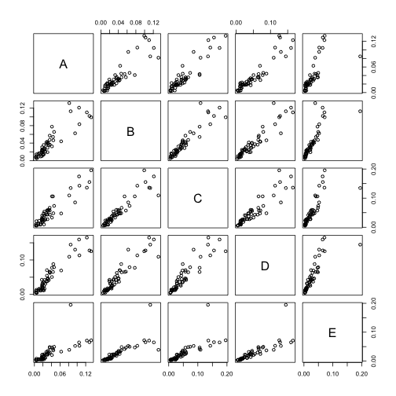

# Coursera Machine Learning Project 

Using devices such as Jawbone Up, Nike FuelBand, and Fitbit it is now possible to collect a large amount of data about personal activity relatively inexpensively. These type of devices are part of the quantified self movement ??? a group of enthusiasts who take measurements about themselves regularly to improve their health, to find patterns in their behavior, or because they are tech geeks. One thing that people regularly do is quantify how much of a particular activity they do, but they rarely quantify how well they do it. In this project, your goal will be to use data from accelerometers on the belt, forearm, arm, and dumbell of 6 participants. They were asked to perform barbell lifts correctly and incorrectly in 5 different ways. More information is available from the website here: http://groupware.les.inf.puc-rio.br/har (see the section on the Weight Lifting Exercise Dataset). 


## Modeling

Load the required library and setwd point it to the project folder.

```r
library(caret)
library(doMC)
library(randomForest)
registerDoMC(cores = 4)
setwd("/Users/bikash/repos/Coursera-Practical-Machine-Learning/project/")
```
First step is to load and process the data,

1.  Read the data using read.csv() function.
1.  Remove  `#DIV/0!` string in excel and replace with `NA` values.
1.  Convert empty strings to `NA` values.


```r
print("Loading Data...")
```

```
## [1] "Loading Data..."
```

```r
train <- read.csv('pml-training.csv',header=TRUE,stringsAsFactors = F,na.strings=c('NA','','#DIV/0!'))
test <- read.csv('pml-testing.csv',header=TRUE,stringsAsFactors = F,na.strings=c('NA','','#DIV/0!'))
```

## Feature Selection

This is an important and useful step need to select the required features. An important goal of any model is to select the important features and to generalize well. The first 7 column are unimportant. so, it is removed from the datasets. Then removing all NA values of data. Given this,

1.  Remove features that contained NA values.
1.  Some columns are dropped as any correlation that exists would likely be spurious and therefore cause the model to perform poorly.

```r
train<-train[,-seq(1:7)]
test<-test[,-seq(1:7)]
NA_d <- apply(train,2,function(x) {sum(is.na(x))}) 
train <- train[,which(NA_d == 0)]
NA_d <- apply(test,2,function(x) {sum(is.na(x))}) 
test <- test[,which(NA_d == 0)]
dim(train)
```

```
## [1] 19622    53
```

There are 53 variable for our prediction model. These variable are listed as below

```r
colnames(train)
```

```
##  [1] "roll_belt"            "pitch_belt"           "yaw_belt"            
##  [4] "total_accel_belt"     "gyros_belt_x"         "gyros_belt_y"        
##  [7] "gyros_belt_z"         "accel_belt_x"         "accel_belt_y"        
## [10] "accel_belt_z"         "magnet_belt_x"        "magnet_belt_y"       
## [13] "magnet_belt_z"        "roll_arm"             "pitch_arm"           
## [16] "yaw_arm"              "total_accel_arm"      "gyros_arm_x"         
## [19] "gyros_arm_y"          "gyros_arm_z"          "accel_arm_x"         
## [22] "accel_arm_y"          "accel_arm_z"          "magnet_arm_x"        
## [25] "magnet_arm_y"         "magnet_arm_z"         "roll_dumbbell"       
## [28] "pitch_dumbbell"       "yaw_dumbbell"         "total_accel_dumbbell"
## [31] "gyros_dumbbell_x"     "gyros_dumbbell_y"     "gyros_dumbbell_z"    
## [34] "accel_dumbbell_x"     "accel_dumbbell_y"     "accel_dumbbell_z"    
## [37] "magnet_dumbbell_x"    "magnet_dumbbell_y"    "magnet_dumbbell_z"   
## [40] "roll_forearm"         "pitch_forearm"        "yaw_forearm"         
## [43] "total_accel_forearm"  "gyros_forearm_x"      "gyros_forearm_y"     
## [46] "gyros_forearm_z"      "accel_forearm_x"      "accel_forearm_y"     
## [49] "accel_forearm_z"      "magnet_forearm_x"     "magnet_forearm_y"    
## [52] "magnet_forearm_z"     "classe"
```
## Cross Validation
Data Partition is achieved by splitting the training data into a test set and a training set. 80% training set and 20% testing set using the following:


```r
data_part <- createDataPartition(y=train$classe, p=0.80, list=FALSE )
training <- train[data_part,]
testing <- train[-data_part,]
```
The data was partioned by the `classe` variable to ensure the training set and test set contain examples of each class.

## PreProcess the split datasets 
Preprocess the datasets by centering and scaling. 53rd variable is classe variable. So, at last we added classe vairable back.


```r
preProc<-preProcess(training[,-53])
train1<-predict(preProc,training[,-53])
test1<-predict(preProc,testing[,-53])
train1$classe <- training$classe
test1$classe <- testing$classe
```


## Out of Sample error:
The random forest model was initially used to prediction. We have created error estimation at first to check whether the random forest accuracy can be achived or not?

Running random forest on partition data  (80% training data and 20% testing data).

```r
RF<-randomForest(as.factor(training$classe) ~.,data = training[,-53],importance = TRUE)
pred_rf<-predict(RF,testing)
#varImp <- varImp(RF)
#plot(varImp, main = "Variable Importance")
```


```r
CM<-confusionMatrix(pred_rf,testing$classe)
CM
```

```
## Confusion Matrix and Statistics
## 
##           Reference
## Prediction    A    B    C    D    E
##          A 1116    3    0    0    0
##          B    0  754    2    0    0
##          C    0    2  682    5    0
##          D    0    0    0  636    1
##          E    0    0    0    2  720
## 
## Overall Statistics
##                                           
##                Accuracy : 0.9962          
##                  95% CI : (0.9937, 0.9979)
##     No Information Rate : 0.2845          
##     P-Value [Acc > NIR] : < 2.2e-16       
##                                           
##                   Kappa : 0.9952          
##  Mcnemar's Test P-Value : NA              
## 
## Statistics by Class:
## 
##                      Class: A Class: B Class: C Class: D Class: E
## Sensitivity            1.0000   0.9934   0.9971   0.9891   0.9986
## Specificity            0.9989   0.9994   0.9978   0.9997   0.9994
## Pos Pred Value         0.9973   0.9974   0.9898   0.9984   0.9972
## Neg Pred Value         1.0000   0.9984   0.9994   0.9979   0.9997
## Prevalence             0.2845   0.1935   0.1744   0.1639   0.1838
## Detection Rate         0.2845   0.1922   0.1738   0.1621   0.1835
## Detection Prevalence   0.2852   0.1927   0.1756   0.1624   0.1840
## Balanced Accuracy      0.9995   0.9964   0.9975   0.9944   0.9990
```

```r
CM$overall  
```

```
##       Accuracy          Kappa  AccuracyLower  AccuracyUpper   AccuracyNull 
##      0.9961764      0.9951631      0.9937014      0.9978584      0.2844762 
## AccuracyPValue  McnemarPValue 
##      0.0000000            NaN
```

The accuracy of the model is 99.5%. 

Now, run the same model for preprocessed data

```r
processRF<-randomForest(as.factor(train1$classe) ~.,data = train1[,-53],importance = TRUE)
predictRF<-predict(processRF,test1)
```


```r
CM1 <- confusionMatrix(predictRF,test1$classe)
CM1
```

```
## Confusion Matrix and Statistics
## 
##           Reference
## Prediction    A    B    C    D    E
##          A 1116    4    0    0    0
##          B    0  754    3    0    0
##          C    0    1  680    6    0
##          D    0    0    1  635    1
##          E    0    0    0    2  720
## 
## Overall Statistics
##                                           
##                Accuracy : 0.9954          
##                  95% CI : (0.9928, 0.9973)
##     No Information Rate : 0.2845          
##     P-Value [Acc > NIR] : < 2.2e-16       
##                                           
##                   Kappa : 0.9942          
##  Mcnemar's Test P-Value : NA              
## 
## Statistics by Class:
## 
##                      Class: A Class: B Class: C Class: D Class: E
## Sensitivity            1.0000   0.9934   0.9942   0.9876   0.9986
## Specificity            0.9986   0.9991   0.9978   0.9994   0.9994
## Pos Pred Value         0.9964   0.9960   0.9898   0.9969   0.9972
## Neg Pred Value         1.0000   0.9984   0.9988   0.9976   0.9997
## Prevalence             0.2845   0.1935   0.1744   0.1639   0.1838
## Detection Rate         0.2845   0.1922   0.1733   0.1619   0.1835
## Detection Prevalence   0.2855   0.1930   0.1751   0.1624   0.1840
## Balanced Accuracy      0.9993   0.9962   0.9960   0.9935   0.9990
```

```r
CM1$overall 
```

```
##       Accuracy          Kappa  AccuracyLower  AccuracyUpper   AccuracyNull 
##      0.9954117      0.9941955      0.9927581      0.9972785      0.2844762 
## AccuracyPValue  McnemarPValue 
##      0.0000000            NaN
```


The error percentage is very low in randomforest.

```r
CM$overall[1]-CM1$overall[1] 
```

```
##     Accuracy 
## 0.0007647209
```
We can observe a high accuracy using randomForest model which is nearly 99.5%. The out-of-sample error rate is 0.05%. Hence we proceed further using random forest in our final prediction. 

### Final Prediction model.
Now we run final prediction model on complete datasets. In random forest the error does decrease with the number of trees. 


```r
finalRF<-randomForest(as.factor(train$classe) ~.,data = train[,-53],importance = TRUE)
```

## Final prediction on test datasets

```r
finalRF.pred<-predict(finalRF,test)
finalRF.pred
```

```
##  1  2  3  4  5  6  7  8  9 10 11 12 13 14 15 16 17 18 19 20 
##  B  A  B  A  A  E  D  B  A  A  B  C  B  A  E  E  A  B  B  B 
## Levels: A B C D E
```
### Variable Importance

```r
print(plot(varImp(finalRF, scale = FALSE)))
```

 

```
## NULL
```

The figure shows the importance variable used for classe (A,B,C,D,E).


## Conclusion
From the above evalution, random forest algorithm appears to fit perfect for accelerometers measurements. Out bag error is very low in random forest.


## Submission of programming assignment in Cousera:
Code is provided by Coursera. Using this code and prediction result from the above results.

```r
pml_write_files = function(x){
  n = length(x)
  path <- "assignment/"
  for(i in 1:n){
    filename = paste0("problem_id_",i,".txt")
    write.table(x[i],file=file.path(path, filename),quote=FALSE,row.names=FALSE,col.names=FALSE)
  }
}
```

Converting prediction result to character in 20 different test cases and using coursera assignment code we created 20 different file for problem.

```r
pml_write_files( as.character(finalRF.pred))
```


