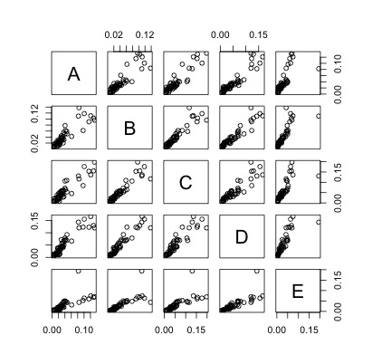

# Coursera Machine Learning Project [05 october-1 nov 2015]

Using devices such as Jawbone Up, Nike FuelBand, and Fitbit it is now possible to collect a large amount of data about personal activity relatively inexpensively. These type of devices are part of the quantified self movement ??? a group of enthusiasts who take measurements about themselves regularly to improve their health, to find patterns in their behavior, or because they are tech geeks. One thing that people regularly do is quantify how much of a particular activity they do, but they rarely quantify how well they do it. In this project, your goal will be to use data from accelerometers on the belt, forearm, arm, and dumbell of 6 participants. They were asked to perform barbell lifts correctly and incorrectly in 5 different ways. More information is available from the website here: http://groupware.les.inf.puc-rio.br/har (see the section on the Weight Lifting Exercise Dataset). 


## Modeling

Load the required library and setwd point it to the project folder.
```{r library}
library(caret)
library(doMC)
library(randomForest)
registerDoMC(cores = 4)
setwd("/Users/bikash/repos/Coursera-Practical-Machine-Learning/project/")
```
First step is to process the data
1.  Read the data.
2.  Remove excel division error strings `#DIV/0!` and replace with `NA` values.
3.  Convert empty strings to `NA` values.

```{r loaddata}
print("Loading Data...")
train <- read.csv('pml-training.csv',header=TRUE,stringsAsFactors = F,na.strings=c('NA','','#DIV/0!'))
test <- read.csv('pml-testing.csv',header=TRUE,stringsAsFactors = F,na.strings=c('NA','','#DIV/0!'))
```

## Feature Selection

The next task is to explore the data and determine what is likely useful information.  An important goal of any model to generalize well with unseen data.  Given this,

1.  Any features that contained NA values should be removed.
1.  Some columns are dropped as any correlation that exists would likely be spurious and therefore cause the model to perform poorly.
```{r remove}
train<-train[,-seq(1:7)]
test<-test[,-seq(1:7)]
NA_d <- apply(train,2,function(x) {sum(is.na(x))}) 
train <- train[,which(NA_d == 0)]
NA_d <- apply(test,2,function(x) {sum(is.na(x))}) 
test <- test[,which(NA_d == 0)]
```

## Cross Validation

Cross validation is achieved by splitting the training data into a test set and a training set. 80% training set and 20% testing set using the following:

```{r cross_validate}
data_part <- createDataPartition(y=train$classe, p=0.80, list=FALSE )
training <- train[data_part,]
testing <- train[-data_part,]

```
The data was partioned by the `classe` variable to ensure the training set and test set contain examples of each class.


## PreProcess
Preprocess the prediction variables by centering and scaling.

```{r}
preProc<-preProcess(training[,-53])
train1<-predict(preProc,training[,-53])
test1<-predict(preProc,testing[,-53])
train1$classe <- training$classe
test1$classe <- testing$classe
```

## Removal of zero variance
Check for near zero variance.

```{r}
nzVar <- nearZeroVar(train1, saveMetrics=TRUE)
if (any(nzVar$nzv)) nzVar else message("No variables with near zero variance")
train1 <- train1[,nzVar$nzv==FALSE]
nzVar <- nearZeroVar(test1, saveMetrics=TRUE)
if (any(nzVar$nzv)) nzVar else message("No variables with near zero variance")
test1 <- test1[,nzVar$nzv==FALSE]
```

## Prediction

The random forest model was initially used to prediction. We have created error estimation at first to check whether the random forest accuracy can be achived or not.

```{r}
RF<-randomForest(as.factor(training$classe) ~.,data = training[,-53],importance = TRUE)
pred_rf<-predict(RF,testing)
```

```{r}
CM<-confusionMatrix(pred_rf,testing$classe)
CM$overall  
```

```{r}
Confusion Matrix and Statistics

          Reference
Prediction    A    B    C    D    E
         A 1116    1    0    0    0
         B    0  757    7    0    0
         C    0    1  677    7    0
         D    0    0    0  636    4
         E    0    0    0    0  717  

Accuracy          Kappa  AccuracyLower  AccuracyUpper   AccuracyNull AccuracyPValue  McnemarPValue 
     0.9949019      0.9935511      0.9921373      0.9968832      0.2844762      0.0000000            NaN 

```

Now applying model to preprocessed data
```{r}
processRF<-randomForest(as.factor(train1$classe) ~.,data = train1[,predVar],importance = TRUE)
predictRF<-predict(processRF,test1)

```

```{r}
CM1 <- confusionMatrix(predictRF,test1$classe)
CM1$overall 
```
Output
```{r}
 Accuracy          Kappa  AccuracyLower  AccuracyUpper   AccuracyNull AccuracyPValue  McnemarPValue 
     0.9946470      0.9932286      0.9918289      0.9966834      0.2844762      0.0000000            NaN 
```

## Calculate accuracy percentage
```{r}
CM$overall[1]-CM1$overall[1] 
0.000254907 
```


### Final Prediction model
```{r}
finalRF<-randomForest(as.factor(train$classe) ~.,data = train,importance = TRUE)
finalRF.pred<-predict(finalRF,test)
finalRF.pred
```

### Variable Importance
```{r }
print(plot(varImp(finalRF, scale = FALSE)))
```


```{r echo=FALSE, comment=""}
cat("")
```


## Conclusion

The random forest algorithm appears to fit very well for predicting activities from accelerometers measurements.
