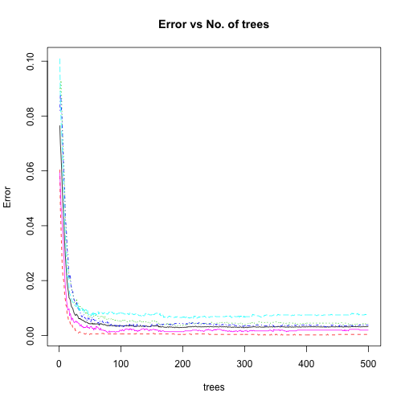

# Coursera Machine Learning Project [05 october-1 nov 2015]

Using devices such as Jawbone Up, Nike FuelBand, and Fitbit it is now possible to collect a large amount of data about personal activity relatively inexpensively. These type of devices are part of the quantified self movement ??? a group of enthusiasts who take measurements about themselves regularly to improve their health, to find patterns in their behavior, or because they are tech geeks. One thing that people regularly do is quantify how much of a particular activity they do, but they rarely quantify how well they do it. In this project, your goal will be to use data from accelerometers on the belt, forearm, arm, and dumbell of 6 participants. They were asked to perform barbell lifts correctly and incorrectly in 5 different ways. More information is available from the website here: http://groupware.les.inf.puc-rio.br/har (see the section on the Weight Lifting Exercise Dataset). 


## Modeling

Load the required library and setwd point it to the project folder.

```r
library(caret)
library(doMC)
library(randomForest)
registerDoMC(cores = 4)
setwd("/Users/bikash/repos/Coursera-Practical-Machine-Learning/project/")
```
First step is to process the data
1.  Read the data.
2.  Remove excel division error strings `#DIV/0!` and replace with `NA` values.
3.  Convert empty strings to `NA` values.


```r
print("Loading Data...")
```

```
## [1] "Loading Data..."
```

```r
train <- read.csv('pml-training.csv',header=TRUE,stringsAsFactors = F,na.strings=c('NA','','#DIV/0!'))
test <- read.csv('pml-testing.csv',header=TRUE,stringsAsFactors = F,na.strings=c('NA','','#DIV/0!'))
```

## Feature Selection

The next task is to explore the data and determine what is likely useful information.  An important goal of any model to generalize well with unseen data.  Given this,

1.  Any features that contained NA values should be removed.
1.  Some columns are dropped as any correlation that exists would likely be spurious and therefore cause the model to perform poorly.

```r
train<-train[,-seq(1:7)]
test<-test[,-seq(1:7)]
NA_d <- apply(train,2,function(x) {sum(is.na(x))}) 
train <- train[,which(NA_d == 0)]
NA_d <- apply(test,2,function(x) {sum(is.na(x))}) 
test <- test[,which(NA_d == 0)]
```
The first 7 column are unimportant. so, we removed it from the datasets. Then removing all NA values of data.

## Cross Validation

Data Partition is achieved by splitting the training data into a test set and a training set. 80% training set and 20% testing set using the following:


```r
data_part <- createDataPartition(y=train$classe, p=0.80, list=FALSE )
training <- train[data_part,]
testing <- train[-data_part,]
```
The data was partioned by the `classe` variable to ensure the training set and test set contain examples of each class.


## PreProcess
Preprocess the prediction variables by centering and scaling.


```r
preProc<-preProcess(training[,-53])
train1<-predict(preProc,training[,-53])
test1<-predict(preProc,testing[,-53])
train1$classe <- training$classe
test1$classe <- testing$classe
```

## Removal of zero variance
Check for near zero variance.


```r
nzVar <- nearZeroVar(train1, saveMetrics=TRUE)
if (any(nzVar$nzv)) nzVar else message("No variables with near zero variance")
```

```
## No variables with near zero variance
```

```r
train1 <- train1[,nzVar$nzv==FALSE]
nzVar <- nearZeroVar(test1, saveMetrics=TRUE)
if (any(nzVar$nzv)) nzVar else message("No variables with near zero variance")
```

```
## No variables with near zero variance
```

```r
test1 <- test1[,nzVar$nzv==FALSE]
```

## Prediction

The random forest model was initially used to prediction. We have created error estimation at first to check whether the random forest accuracy can be achived or not.

Running random forest on 80% training data and 20% testing data.

```r
RF<-randomForest(as.factor(training$classe) ~.,data = training[,-53],importance = TRUE)
pred_rf<-predict(RF,testing)
```


```r
CM<-confusionMatrix(pred_rf,testing$classe)
CM
```

```
## Confusion Matrix and Statistics
## 
##           Reference
## Prediction    A    B    C    D    E
##          A 1116    2    0    0    0
##          B    0  756    2    0    0
##          C    0    1  680    7    0
##          D    0    0    2  636    3
##          E    0    0    0    0  718
## 
## Overall Statistics
##                                           
##                Accuracy : 0.9957          
##                  95% CI : (0.9931, 0.9975)
##     No Information Rate : 0.2845          
##     P-Value [Acc > NIR] : < 2.2e-16       
##                                           
##                   Kappa : 0.9945          
##  Mcnemar's Test P-Value : NA              
## 
## Statistics by Class:
## 
##                      Class: A Class: B Class: C Class: D Class: E
## Sensitivity            1.0000   0.9960   0.9942   0.9891   0.9958
## Specificity            0.9993   0.9994   0.9975   0.9985   1.0000
## Pos Pred Value         0.9982   0.9974   0.9884   0.9922   1.0000
## Neg Pred Value         1.0000   0.9991   0.9988   0.9979   0.9991
## Prevalence             0.2845   0.1935   0.1744   0.1639   0.1838
## Detection Rate         0.2845   0.1927   0.1733   0.1621   0.1830
## Detection Prevalence   0.2850   0.1932   0.1754   0.1634   0.1830
## Balanced Accuracy      0.9996   0.9977   0.9958   0.9938   0.9979
```

```r
CM$overall  
```

```
##       Accuracy          Kappa  AccuracyLower  AccuracyUpper   AccuracyNull 
##      0.9956666      0.9945185      0.9930708      0.9974737      0.2844762 
## AccuracyPValue  McnemarPValue 
##      0.0000000            NaN
```


Now, run the same model for preprocessed data

```r
processRF<-randomForest(as.factor(train1$classe) ~.,data = train1[,predVar],importance = TRUE)
predictRF<-predict(processRF,test1)
```


```r
CM1 <- confusionMatrix(predictRF,test1$classe)
CM1
```

```
## Confusion Matrix and Statistics
## 
##           Reference
## Prediction    A    B    C    D    E
##          A 1115    2    0    0    0
##          B    1  756    2    0    0
##          C    0    1  680   10    0
##          D    0    0    2  633    3
##          E    0    0    0    0  718
## 
## Overall Statistics
##                                           
##                Accuracy : 0.9946          
##                  95% CI : (0.9918, 0.9967)
##     No Information Rate : 0.2845          
##     P-Value [Acc > NIR] : < 2.2e-16       
##                                           
##                   Kappa : 0.9932          
##  Mcnemar's Test P-Value : NA              
## 
## Statistics by Class:
## 
##                      Class: A Class: B Class: C Class: D Class: E
## Sensitivity            0.9991   0.9960   0.9942   0.9844   0.9958
## Specificity            0.9993   0.9991   0.9966   0.9985   1.0000
## Pos Pred Value         0.9982   0.9960   0.9841   0.9922   1.0000
## Neg Pred Value         0.9996   0.9991   0.9988   0.9970   0.9991
## Prevalence             0.2845   0.1935   0.1744   0.1639   0.1838
## Detection Rate         0.2842   0.1927   0.1733   0.1614   0.1830
## Detection Prevalence   0.2847   0.1935   0.1761   0.1626   0.1830
## Balanced Accuracy      0.9992   0.9975   0.9954   0.9915   0.9979
```

```r
CM1$overall 
```

```
##       Accuracy          Kappa  AccuracyLower  AccuracyUpper   AccuracyNull 
##      0.9946470      0.9932288      0.9918289      0.9966834      0.2844762 
## AccuracyPValue  McnemarPValue 
##      0.0000000            NaN
```


## Calculate accuracy percentage

```r
CM$overall[1]-CM1$overall[1] 
```

```
##    Accuracy 
## 0.001019628
```


### Final Prediction model
Now we run final prediction model on full datasets. In random forest the error does decrease with the number of trees. The following plot shows the training error vs number of trees.


```r
finalRF<-randomForest(as.factor(train$classe) ~.,data = train,importance = TRUE)
print(plot(finalRF,main="Error vs No. of trees"))
```

 

```
##                OOB            A           B           C           D
##   [1,] 0.076596328 0.0604697651 0.090204369 0.081967213 0.100985222
##   [2,] 0.069835681 0.0462427746 0.088964927 0.088011418 0.085728953
##   [3,] 0.065789474 0.0391398889 0.092998955 0.086186995 0.078688525
##   [4,] 0.060556564 0.0316780822 0.086915595 0.081435473 0.074128984
##   [5,] 0.054049446 0.0251407884 0.076719577 0.077098243 0.068284229
##   [6,] 0.048334244 0.0218188840 0.070883931 0.067939887 0.059488202
##   [7,] 0.044338118 0.0204349456 0.066666667 0.061906221 0.055214724
##   [8,] 0.038896451 0.0187776141 0.060146302 0.055790109 0.044253422
##   [9,] 0.033569911 0.0142309797 0.052716082 0.051251490 0.039432177
##  [10,] 0.029151215 0.0130529369 0.044266667 0.042553191 0.037304075
##  [11,] 0.025693625 0.0110148068 0.039002388 0.040317834 0.031181790
##  [12,] 0.022665643 0.0106210621 0.034099921 0.036971831 0.026168224
##  [13,] 0.019009658 0.0071942446 0.030878860 0.031066823 0.021488633
##  [14,] 0.017203533 0.0071877808 0.024242424 0.030143401 0.021475257
##  [15,] 0.015915119 0.0055625336 0.024505929 0.025446037 0.020852786
##  [16,] 0.013716792 0.0052017937 0.020547945 0.020754165 0.017418351
##  [17,] 0.013408106 0.0053782718 0.021595997 0.022215726 0.015241058
##  [18,] 0.012896977 0.0043026174 0.020279168 0.021923414 0.014930016
##  [19,] 0.011367691 0.0037647902 0.018435607 0.018415668 0.013685848
##  [20,] 0.010500561 0.0032269631 0.017382144 0.017241379 0.013374806
##  [21,] 0.010142712 0.0037647902 0.016328681 0.015488019 0.012437811
##  [22,] 0.009836400 0.0028678975 0.016065315 0.016072472 0.012126866
##  [23,] 0.009020487 0.0030465950 0.014221754 0.014319112 0.011815920
##  [24,] 0.008256039 0.0026881720 0.012641559 0.013150205 0.011504975
##  [25,] 0.007797370 0.0028673835 0.011061364 0.012565751 0.010883085
##  [26,] 0.007338701 0.0017921147 0.010797998 0.011689071 0.010883085
##  [27,] 0.007338701 0.0017921147 0.011061364 0.011396844 0.010572139
##  [28,] 0.007797370 0.0016129032 0.013431657 0.012273524 0.010572139
##  [29,] 0.007440628 0.0014336918 0.012378193 0.011104617 0.010883085
##  [30,] 0.007134849 0.0010752688 0.012114827 0.009643483 0.011815920
##  [31,] 0.006523290 0.0008960573 0.010534633 0.010227937 0.009950249
##  [32,] 0.006013658 0.0010752688 0.009481169 0.009351257 0.008706468
##  [33,] 0.006268474 0.0012544803 0.010534633 0.008766803 0.009950249
##  [34,] 0.005911732 0.0012544803 0.010534633 0.008182350 0.009017413
##  [35,] 0.006013658 0.0010752688 0.010271267 0.008182350 0.009639303
##  [36,] 0.005758842 0.0010752688 0.009744535 0.007013442 0.009950249
##  [37,] 0.005605953 0.0010752688 0.010007901 0.006721216 0.009950249
##  [38,] 0.005504026 0.0008960573 0.009481169 0.007597896 0.009017413
##  [39,] 0.005402100 0.0008960573 0.009217804 0.007305669 0.009639303
##  [40,] 0.005300173 0.0007168459 0.009744535 0.007597896 0.008395522
##  [41,] 0.004994394 0.0005376344 0.008691072 0.006428989 0.009017413
##  [42,] 0.004994394 0.0005376344 0.008691072 0.006428989 0.009328358
##  [43,] 0.004790541 0.0005376344 0.007637609 0.006136762 0.009328358
##  [44,] 0.004841504 0.0007168459 0.008427706 0.005260082 0.009328358
##  [45,] 0.004841504 0.0005376344 0.008691072 0.005552309 0.008395522
##  [46,] 0.004484762 0.0007168459 0.007110877 0.005260082 0.009017413
##  [47,] 0.004535725 0.0007168459 0.007110877 0.006428989 0.007773632
##  [48,] 0.004280909 0.0005376344 0.007374243 0.005552309 0.007462687
##  [49,] 0.004280909 0.0003584229 0.007110877 0.006136762 0.007773632
##  [50,] 0.004178983 0.0005376344 0.006584145 0.005552309 0.007462687
##  [51,] 0.004331872 0.0005376344 0.007374243 0.004967855 0.007773632
##  [52,] 0.004280909 0.0005376344 0.007110877 0.005552309 0.007151741
##  [53,] 0.004484762 0.0005376344 0.006847511 0.006721216 0.008084577
##  [54,] 0.004077056 0.0005376344 0.006847511 0.005552309 0.007151741
##  [55,] 0.004382836 0.0005376344 0.006847511 0.005844535 0.008395522
##  [56,] 0.004077056 0.0005376344 0.007110877 0.005844535 0.007151741
##  [57,] 0.004280909 0.0005376344 0.006847511 0.005552309 0.008084577
##  [58,] 0.004077056 0.0005376344 0.006847511 0.004967855 0.007773632
##  [59,] 0.004280909 0.0005376344 0.007374243 0.005552309 0.008084577
##  [60,] 0.004280909 0.0005376344 0.007110877 0.005260082 0.007462687
##  [61,] 0.004128020 0.0005376344 0.006847511 0.004675628 0.007773632
##  [62,] 0.004229946 0.0005376344 0.006847511 0.004675628 0.008395522
##  [63,] 0.004280909 0.0005376344 0.007110877 0.004675628 0.008706468
##  [64,] 0.003873204 0.0005376344 0.006057414 0.004675628 0.007773632
##  [65,] 0.003873204 0.0005376344 0.006320780 0.004091175 0.008395522
##  [66,] 0.004026093 0.0005376344 0.006320780 0.005260082 0.008395522
##  [67,] 0.004382836 0.0007168459 0.007110877 0.005260082 0.008395522
##  [68,] 0.004128020 0.0007168459 0.006847511 0.005260082 0.008084577
##  [69,] 0.004178983 0.0007168459 0.007110877 0.004967855 0.008395522
##  [70,] 0.004026093 0.0007168459 0.006320780 0.005260082 0.008084577
##  [71,] 0.003924167 0.0007168459 0.006584145 0.004675628 0.007773632
##  [72,] 0.004026093 0.0007168459 0.006847511 0.004675628 0.008084577
##  [73,] 0.003873204 0.0005376344 0.006057414 0.004967855 0.008395522
##  [74,] 0.004026093 0.0005376344 0.007110877 0.004967855 0.007773632
##  [75,] 0.003771277 0.0005376344 0.006057414 0.004675628 0.008084577
##  [76,] 0.003771277 0.0005376344 0.006057414 0.004967855 0.008084577
##  [77,] 0.003567424 0.0005376344 0.005794048 0.004383402 0.007773632
##  [78,] 0.003669351 0.0005376344 0.006057414 0.004967855 0.007773632
##  [79,] 0.003465498 0.0005376344 0.005794048 0.004091175 0.007773632
##  [80,] 0.003771277 0.0005376344 0.006057414 0.004675628 0.008395522
##  [81,] 0.003669351 0.0005376344 0.005794048 0.004091175 0.008395522
##  [82,] 0.003516461 0.0005376344 0.005794048 0.003506721 0.008706468
##  [83,] 0.003669351 0.0005376344 0.005794048 0.003798948 0.009017413
##  [84,] 0.003720314 0.0005376344 0.006057414 0.004091175 0.008706468
##  [85,] 0.003567424 0.0007168459 0.005530682 0.003798948 0.008395522
##  [86,] 0.003465498 0.0005376344 0.005794048 0.003214494 0.008395522
##  [87,] 0.003618388 0.0007168459 0.005794048 0.003798948 0.008395522
##  [88,] 0.003516461 0.0005376344 0.006057414 0.003798948 0.007773632
##  [89,] 0.003465498 0.0005376344 0.005794048 0.003506721 0.008084577
##  [90,] 0.003465498 0.0005376344 0.005530682 0.003798948 0.008084577
##  [91,] 0.003414535 0.0005376344 0.005530682 0.003506721 0.008395522
##  [92,] 0.003312608 0.0005376344 0.005267316 0.003506721 0.007773632
##  [93,] 0.003465498 0.0005376344 0.005530682 0.004091175 0.007773632
##  [94,] 0.003363572 0.0005376344 0.005530682 0.003506721 0.007773632
##  [95,] 0.003414535 0.0005376344 0.005267316 0.003798948 0.008084577
##  [96,] 0.003465498 0.0005376344 0.005267316 0.004091175 0.008084577
##  [97,] 0.003363572 0.0005376344 0.005530682 0.003214494 0.008084577
##  [98,] 0.003516461 0.0005376344 0.005267316 0.003798948 0.008084577
##  [99,] 0.003567424 0.0005376344 0.005530682 0.003506721 0.008395522
## [100,] 0.003414535 0.0005376344 0.005003950 0.003506721 0.008395522
## [101,] 0.003465498 0.0005376344 0.005530682 0.003506721 0.008084577
## [102,] 0.003516461 0.0005376344 0.005794048 0.002922268 0.008084577
## [103,] 0.003414535 0.0005376344 0.005530682 0.002922268 0.008084577
## [104,] 0.003363572 0.0005376344 0.005003950 0.003506721 0.008084577
## [105,] 0.003363572 0.0005376344 0.005267316 0.003506721 0.007773632
## [106,] 0.003516461 0.0005376344 0.005530682 0.003506721 0.007773632
## [107,] 0.003465498 0.0005376344 0.005267316 0.003506721 0.007773632
## [108,] 0.003567424 0.0005376344 0.005267316 0.004091175 0.007773632
## [109,] 0.003465498 0.0005376344 0.005003950 0.003798948 0.007462687
## [110,] 0.003516461 0.0005376344 0.005003950 0.004091175 0.007773632
## [111,] 0.003567424 0.0005376344 0.005003950 0.004091175 0.008084577
## [112,] 0.003516461 0.0005376344 0.005003950 0.004091175 0.007773632
## [113,] 0.003363572 0.0005376344 0.005003950 0.003798948 0.007462687
## [114,] 0.003669351 0.0005376344 0.005267316 0.004091175 0.008084577
## [115,] 0.003516461 0.0005376344 0.005267316 0.003214494 0.008395522
## [116,] 0.003669351 0.0005376344 0.005530682 0.003506721 0.008395522
## [117,] 0.003516461 0.0005376344 0.005267316 0.003798948 0.008084577
## [118,] 0.003465498 0.0005376344 0.005267316 0.003506721 0.007773632
## [119,] 0.003567424 0.0005376344 0.005794048 0.003506721 0.007773632
## [120,] 0.003618388 0.0005376344 0.005530682 0.004091175 0.007773632
## [121,] 0.003261645 0.0005376344 0.004740585 0.003214494 0.007462687
## [122,] 0.003261645 0.0005376344 0.005003950 0.003214494 0.007773632
## [123,] 0.003261645 0.0005376344 0.005003950 0.002922268 0.007773632
## [124,] 0.003312608 0.0005376344 0.004740585 0.003798948 0.007773632
## [125,] 0.003261645 0.0007168459 0.004477219 0.003214494 0.008084577
## [126,] 0.003414535 0.0007168459 0.004477219 0.004091175 0.007773632
## [127,] 0.003414535 0.0007168459 0.005267316 0.003798948 0.007773632
## [128,] 0.003363572 0.0005376344 0.005267316 0.003798948 0.007462687
## [129,] 0.003363572 0.0005376344 0.005267316 0.003798948 0.007151741
## [130,] 0.003312608 0.0005376344 0.005267316 0.003798948 0.007151741
## [131,] 0.003414535 0.0005376344 0.005267316 0.003798948 0.007462687
## [132,] 0.003465498 0.0005376344 0.005530682 0.003798948 0.007151741
## [133,] 0.003363572 0.0005376344 0.005267316 0.003798948 0.006840796
## [134,] 0.003261645 0.0005376344 0.004740585 0.003506721 0.007151741
## [135,] 0.003465498 0.0005376344 0.005267316 0.003506721 0.007462687
## [136,] 0.003363572 0.0005376344 0.005003950 0.003506721 0.007151741
## [137,] 0.003363572 0.0005376344 0.005003950 0.003506721 0.007151741
## [138,] 0.003210682 0.0005376344 0.004740585 0.003506721 0.007151741
## [139,] 0.003363572 0.0005376344 0.005003950 0.003214494 0.007773632
## [140,] 0.003465498 0.0005376344 0.005003950 0.003506721 0.008084577
## [141,] 0.003414535 0.0005376344 0.004740585 0.003506721 0.007773632
## [142,] 0.003363572 0.0005376344 0.005003950 0.003506721 0.007462687
## [143,] 0.003261645 0.0005376344 0.004740585 0.003214494 0.007462687
## [144,] 0.003261645 0.0005376344 0.004740585 0.003214494 0.007773632
## [145,] 0.003261645 0.0005376344 0.005003950 0.003214494 0.007773632
## [146,] 0.003210682 0.0005376344 0.005003950 0.003214494 0.007462687
## [147,] 0.003210682 0.0005376344 0.004477219 0.003214494 0.007462687
## [148,] 0.003261645 0.0005376344 0.005003950 0.003214494 0.007462687
## [149,] 0.003363572 0.0005376344 0.005003950 0.003798948 0.007462687
## [150,] 0.003465498 0.0005376344 0.005267316 0.004091175 0.007462687
## [151,] 0.003618388 0.0007168459 0.005267316 0.003798948 0.008084577
## [152,] 0.003516461 0.0007168459 0.005267316 0.003506721 0.007773632
## [153,] 0.003414535 0.0007168459 0.005003950 0.003506721 0.007462687
## [154,] 0.003516461 0.0005376344 0.005267316 0.003798948 0.007773632
## [155,] 0.003414535 0.0005376344 0.005267316 0.003506721 0.007773632
## [156,] 0.003465498 0.0005376344 0.004740585 0.003798948 0.008084577
## [157,] 0.003465498 0.0005376344 0.005003950 0.003798948 0.008084577
## [158,] 0.003516461 0.0005376344 0.005003950 0.004091175 0.008084577
## [159,] 0.003516461 0.0005376344 0.005003950 0.004091175 0.008084577
## [160,] 0.003465498 0.0005376344 0.005003950 0.003798948 0.008084577
## [161,] 0.003159719 0.0005376344 0.004213853 0.003798948 0.007773632
## [162,] 0.003057792 0.0005376344 0.003687121 0.003798948 0.007462687
## [163,] 0.003363572 0.0005376344 0.004213853 0.004091175 0.008084577
## [164,] 0.003006829 0.0005376344 0.004213853 0.003506721 0.007151741
## [165,] 0.003057792 0.0005376344 0.004213853 0.003798948 0.007151741
## [166,] 0.003159719 0.0005376344 0.003950487 0.004091175 0.007462687
## [167,] 0.003159719 0.0005376344 0.003950487 0.003798948 0.007773632
## [168,] 0.003159719 0.0005376344 0.003950487 0.004091175 0.007462687
## [169,] 0.003057792 0.0005376344 0.004213853 0.004091175 0.006529851
## [170,] 0.003006829 0.0005376344 0.003950487 0.004091175 0.006840796
## [171,] 0.002955866 0.0005376344 0.003950487 0.004091175 0.006529851
## [172,] 0.003006829 0.0005376344 0.003950487 0.004091175 0.006840796
## [173,] 0.002955866 0.0005376344 0.003950487 0.004091175 0.006529851
## [174,] 0.002955866 0.0005376344 0.003950487 0.004091175 0.006529851
## [175,] 0.003108755 0.0005376344 0.004477219 0.004383402 0.006529851
## [176,] 0.003108755 0.0005376344 0.004740585 0.004091175 0.006529851
## [177,] 0.002904903 0.0005376344 0.003423756 0.004091175 0.006840796
## [178,] 0.003108755 0.0005376344 0.004213853 0.004091175 0.007151741
## [179,] 0.003108755 0.0005376344 0.004477219 0.004091175 0.006840796
## [180,] 0.003006829 0.0005376344 0.004213853 0.003798948 0.006840796
## [181,] 0.003108755 0.0005376344 0.004213853 0.004383402 0.006840796
## [182,] 0.003057792 0.0005376344 0.003950487 0.004383402 0.006840796
## [183,] 0.002955866 0.0005376344 0.004213853 0.003798948 0.006529851
## [184,] 0.002955866 0.0005376344 0.003950487 0.004091175 0.006529851
## [185,] 0.003006829 0.0005376344 0.003950487 0.004383402 0.006529851
## [186,] 0.002955866 0.0005376344 0.003950487 0.004091175 0.006529851
## [187,] 0.002853939 0.0003584229 0.003423756 0.004383402 0.006529851
## [188,] 0.003006829 0.0005376344 0.003687121 0.004383402 0.006840796
## [189,] 0.002904903 0.0005376344 0.003423756 0.004383402 0.006529851
## [190,] 0.003006829 0.0005376344 0.003687121 0.004383402 0.006840796
## [191,] 0.002955866 0.0003584229 0.003687121 0.004383402 0.006840796
## [192,] 0.002904903 0.0003584229 0.003423756 0.004383402 0.006840796
## [193,] 0.002853939 0.0003584229 0.003423756 0.004383402 0.006529851
## [194,] 0.002853939 0.0003584229 0.003423756 0.004383402 0.006529851
## [195,] 0.002853939 0.0003584229 0.003423756 0.004383402 0.006529851
## [196,] 0.002904903 0.0003584229 0.003687121 0.004383402 0.006529851
## [197,] 0.002904903 0.0003584229 0.003687121 0.004383402 0.006529851
## [198,] 0.002853939 0.0003584229 0.003423756 0.004383402 0.006529851
## [199,] 0.002904903 0.0003584229 0.003687121 0.004383402 0.006529851
## [200,] 0.002955866 0.0003584229 0.003687121 0.004383402 0.006840796
## [201,] 0.002904903 0.0003584229 0.003950487 0.004091175 0.006529851
## [202,] 0.002955866 0.0003584229 0.003950487 0.004091175 0.006840796
## [203,] 0.002955866 0.0003584229 0.003950487 0.004091175 0.006529851
## [204,] 0.002955866 0.0003584229 0.003950487 0.004091175 0.006529851
## [205,] 0.002955866 0.0005376344 0.003687121 0.004091175 0.006529851
## [206,] 0.003108755 0.0005376344 0.003950487 0.004383402 0.006840796
## [207,] 0.002904903 0.0005376344 0.003687121 0.004091175 0.006218905
## [208,] 0.003108755 0.0005376344 0.004477219 0.004383402 0.006218905
## [209,] 0.003159719 0.0005376344 0.004213853 0.004675628 0.006529851
## [210,] 0.003108755 0.0005376344 0.004213853 0.004383402 0.006529851
## [211,] 0.003159719 0.0005376344 0.004213853 0.004967855 0.006218905
## [212,] 0.003261645 0.0005376344 0.004477219 0.004967855 0.006529851
## [213,] 0.003108755 0.0003584229 0.004477219 0.004383402 0.006529851
## [214,] 0.003159719 0.0003584229 0.004740585 0.004383402 0.006529851
## [215,] 0.003261645 0.0005376344 0.004740585 0.004383402 0.006529851
## [216,] 0.003261645 0.0005376344 0.004213853 0.004675628 0.006840796
## [217,] 0.003159719 0.0005376344 0.004477219 0.004383402 0.006218905
## [218,] 0.003261645 0.0005376344 0.004213853 0.004383402 0.007151741
## [219,] 0.003210682 0.0005376344 0.004477219 0.004091175 0.006840796
## [220,] 0.003210682 0.0005376344 0.004213853 0.004383402 0.006840796
## [221,] 0.003363572 0.0005376344 0.004477219 0.004675628 0.007151741
## [222,] 0.003210682 0.0005376344 0.004477219 0.004383402 0.006529851
## [223,] 0.003159719 0.0005376344 0.004477219 0.004383402 0.006218905
## [224,] 0.003108755 0.0005376344 0.004213853 0.004383402 0.006529851
## [225,] 0.003108755 0.0005376344 0.004213853 0.004383402 0.006529851
## [226,] 0.003261645 0.0005376344 0.004213853 0.004675628 0.006840796
## [227,] 0.003159719 0.0005376344 0.004213853 0.004383402 0.006529851
## [228,] 0.003108755 0.0005376344 0.004213853 0.004091175 0.006840796
## [229,] 0.003159719 0.0005376344 0.004477219 0.003798948 0.007151741
## [230,] 0.003108755 0.0005376344 0.004213853 0.004091175 0.006840796
## [231,] 0.003108755 0.0005376344 0.004477219 0.003798948 0.006840796
## [232,] 0.003159719 0.0005376344 0.004213853 0.004383402 0.006840796
## [233,] 0.003159719 0.0005376344 0.004213853 0.004383402 0.006840796
## [234,] 0.003108755 0.0005376344 0.004213853 0.004383402 0.006840796
## [235,] 0.003159719 0.0005376344 0.003950487 0.004383402 0.007151741
## [236,] 0.003210682 0.0005376344 0.004213853 0.004383402 0.006840796
## [237,] 0.003159719 0.0005376344 0.004213853 0.004383402 0.006529851
## [238,] 0.003108755 0.0005376344 0.004477219 0.003798948 0.006529851
## [239,] 0.003210682 0.0005376344 0.004477219 0.004091175 0.006529851
## [240,] 0.003210682 0.0005376344 0.004477219 0.004383402 0.006529851
## [241,] 0.003261645 0.0005376344 0.004477219 0.004091175 0.006840796
## [242,] 0.003159719 0.0005376344 0.004213853 0.004091175 0.006529851
## [243,] 0.003108755 0.0003584229 0.004477219 0.004091175 0.006529851
## [244,] 0.003261645 0.0003584229 0.004740585 0.004383402 0.006840796
## [245,] 0.003210682 0.0003584229 0.004740585 0.004091175 0.006840796
## [246,] 0.003210682 0.0003584229 0.004740585 0.004091175 0.006840796
## [247,] 0.003159719 0.0003584229 0.004740585 0.004091175 0.006840796
## [248,] 0.003159719 0.0003584229 0.004740585 0.004091175 0.006840796
## [249,] 0.003108755 0.0003584229 0.004477219 0.003798948 0.006840796
## [250,] 0.003108755 0.0003584229 0.004477219 0.003798948 0.006840796
## [251,] 0.003159719 0.0003584229 0.004213853 0.004091175 0.006840796
## [252,] 0.003159719 0.0003584229 0.004477219 0.003798948 0.007151741
## [253,] 0.003210682 0.0003584229 0.004477219 0.004091175 0.006840796
## [254,] 0.003108755 0.0003584229 0.004477219 0.003798948 0.006840796
## [255,] 0.003210682 0.0003584229 0.004477219 0.004091175 0.006840796
## [256,] 0.003159719 0.0003584229 0.004477219 0.003798948 0.006840796
## [257,] 0.003108755 0.0003584229 0.004213853 0.003798948 0.006840796
## [258,] 0.003057792 0.0003584229 0.004213853 0.003506721 0.006840796
## [259,] 0.003159719 0.0003584229 0.004477219 0.003798948 0.006840796
## [260,] 0.003261645 0.0003584229 0.004740585 0.004091175 0.006840796
## [261,] 0.003261645 0.0003584229 0.004740585 0.004091175 0.006840796
## [262,] 0.003108755 0.0003584229 0.004477219 0.003798948 0.006840796
## [263,] 0.003159719 0.0003584229 0.004740585 0.003798948 0.006840796
## [264,] 0.003210682 0.0003584229 0.004740585 0.004091175 0.006840796
## [265,] 0.003108755 0.0003584229 0.004740585 0.003798948 0.006840796
## [266,] 0.003159719 0.0003584229 0.004477219 0.004091175 0.006840796
## [267,] 0.003159719 0.0003584229 0.004477219 0.004091175 0.006840796
## [268,] 0.003159719 0.0003584229 0.004740585 0.004091175 0.006840796
## [269,] 0.003108755 0.0003584229 0.004477219 0.004091175 0.006840796
## [270,] 0.003159719 0.0003584229 0.004740585 0.003798948 0.007151741
## [271,] 0.003108755 0.0003584229 0.004740585 0.003798948 0.006840796
## [272,] 0.003159719 0.0003584229 0.004740585 0.003798948 0.007151741
## [273,] 0.002955866 0.0003584229 0.004213853 0.003506721 0.007151741
## [274,] 0.003108755 0.0003584229 0.004477219 0.003798948 0.007151741
## [275,] 0.003057792 0.0003584229 0.004477219 0.003798948 0.006840796
## [276,] 0.003108755 0.0003584229 0.004477219 0.003798948 0.007151741
## [277,] 0.003057792 0.0003584229 0.004477219 0.003798948 0.007151741
## [278,] 0.003006829 0.0003584229 0.004477219 0.003798948 0.006529851
## [279,] 0.002904903 0.0003584229 0.004477219 0.003506721 0.006529851
## [280,] 0.002955866 0.0003584229 0.004477219 0.003798948 0.006529851
## [281,] 0.003057792 0.0003584229 0.004477219 0.004091175 0.006840796
## [282,] 0.002955866 0.0003584229 0.004477219 0.003506721 0.006840796
## [283,] 0.003108755 0.0003584229 0.004477219 0.003798948 0.007151741
## [284,] 0.003006829 0.0003584229 0.004477219 0.003798948 0.006840796
## [285,] 0.003006829 0.0003584229 0.004477219 0.003506721 0.006840796
## [286,] 0.003006829 0.0003584229 0.004477219 0.003506721 0.006840796
## [287,] 0.003006829 0.0003584229 0.004477219 0.003506721 0.006840796
## [288,] 0.002955866 0.0003584229 0.004477219 0.003506721 0.006840796
## [289,] 0.002904903 0.0003584229 0.004213853 0.003506721 0.006840796
## [290,] 0.003006829 0.0003584229 0.004213853 0.003506721 0.007151741
## [291,] 0.002904903 0.0003584229 0.004477219 0.003506721 0.006218905
## [292,] 0.003006829 0.0003584229 0.004213853 0.003506721 0.007151741
## [293,] 0.003057792 0.0003584229 0.004477219 0.003506721 0.006840796
## [294,] 0.003108755 0.0003584229 0.004740585 0.003506721 0.007151741
## [295,] 0.002904903 0.0003584229 0.004213853 0.003506721 0.006840796
## [296,] 0.003006829 0.0003584229 0.004213853 0.003506721 0.007151741
## [297,] 0.002955866 0.0003584229 0.004213853 0.003506721 0.007151741
## [298,] 0.002752013 0.0003584229 0.003950487 0.003214494 0.006529851
## [299,] 0.002955866 0.0003584229 0.003950487 0.003506721 0.007151741
## [300,] 0.002853939 0.0003584229 0.003950487 0.003506721 0.006529851
## [301,] 0.002904903 0.0003584229 0.003950487 0.003506721 0.006840796
## [302,] 0.002904903 0.0003584229 0.003950487 0.003506721 0.006840796
## [303,] 0.003006829 0.0003584229 0.003950487 0.003798948 0.006840796
## [304,] 0.002853939 0.0003584229 0.003950487 0.003506721 0.006840796
## [305,] 0.002904903 0.0003584229 0.004213853 0.003506721 0.006840796
## [306,] 0.002955866 0.0003584229 0.004477219 0.003506721 0.006840796
## [307,] 0.002955866 0.0003584229 0.004213853 0.003506721 0.006840796
## [308,] 0.003006829 0.0003584229 0.004477219 0.003506721 0.006840796
## [309,] 0.003006829 0.0003584229 0.004477219 0.003506721 0.006840796
## [310,] 0.003057792 0.0003584229 0.004213853 0.003506721 0.007151741
## [311,] 0.003006829 0.0003584229 0.004477219 0.003506721 0.006840796
## [312,] 0.003108755 0.0003584229 0.004740585 0.003506721 0.007151741
## [313,] 0.003108755 0.0003584229 0.004213853 0.003506721 0.007773632
## [314,] 0.003159719 0.0003584229 0.004477219 0.003506721 0.007462687
## [315,] 0.003108755 0.0003584229 0.004477219 0.003506721 0.007462687
## [316,] 0.003159719 0.0003584229 0.004477219 0.003798948 0.007462687
## [317,] 0.003159719 0.0003584229 0.004477219 0.003798948 0.007462687
## [318,] 0.003057792 0.0003584229 0.004213853 0.003798948 0.007151741
## [319,] 0.003006829 0.0001792115 0.004213853 0.003798948 0.007151741
## [320,] 0.003057792 0.0003584229 0.004213853 0.003798948 0.007151741
## [321,] 0.003057792 0.0003584229 0.004213853 0.003798948 0.007151741
## [322,] 0.003006829 0.0001792115 0.004213853 0.003798948 0.007151741
## [323,] 0.003159719 0.0001792115 0.005003950 0.003798948 0.007151741
## [324,] 0.003159719 0.0003584229 0.005003950 0.003798948 0.006840796
## [325,] 0.003057792 0.0001792115 0.004740585 0.003798948 0.006840796
## [326,] 0.003057792 0.0001792115 0.004740585 0.003798948 0.006840796
## [327,] 0.003006829 0.0001792115 0.004740585 0.003798948 0.006529851
## [328,] 0.003057792 0.0001792115 0.004740585 0.003798948 0.006840796
## [329,] 0.003006829 0.0001792115 0.004740585 0.003506721 0.006840796
## [330,] 0.003006829 0.0001792115 0.004740585 0.003506721 0.006840796
## [331,] 0.003006829 0.0001792115 0.004740585 0.003506721 0.006840796
## [332,] 0.003159719 0.0003584229 0.004740585 0.003506721 0.007462687
## [333,] 0.003006829 0.0001792115 0.004477219 0.003506721 0.007151741
## [334,] 0.003108755 0.0001792115 0.004740585 0.003506721 0.007462687
## [335,] 0.003108755 0.0001792115 0.004740585 0.003506721 0.007462687
## [336,] 0.003108755 0.0001792115 0.004740585 0.003506721 0.007462687
## [337,] 0.003108755 0.0001792115 0.004740585 0.003506721 0.007462687
## [338,] 0.003057792 0.0001792115 0.004740585 0.003506721 0.007151741
## [339,] 0.003057792 0.0001792115 0.004740585 0.003506721 0.007151741
## [340,] 0.003159719 0.0001792115 0.004740585 0.003798948 0.007151741
## [341,] 0.003108755 0.0001792115 0.004477219 0.003798948 0.007151741
## [342,] 0.003108755 0.0001792115 0.004477219 0.003798948 0.007151741
## [343,] 0.003159719 0.0003584229 0.004740585 0.003798948 0.007151741
## [344,] 0.003108755 0.0001792115 0.004740585 0.003798948 0.007151741
## [345,] 0.003108755 0.0001792115 0.004740585 0.003798948 0.007151741
## [346,] 0.003057792 0.0001792115 0.004740585 0.003506721 0.007462687
## [347,] 0.003261645 0.0003584229 0.004740585 0.003506721 0.007462687
## [348,] 0.003108755 0.0001792115 0.004740585 0.003214494 0.007462687
## [349,] 0.003108755 0.0003584229 0.004740585 0.003214494 0.007151741
## [350,] 0.003108755 0.0001792115 0.005003950 0.003214494 0.007151741
## [351,] 0.003159719 0.0003584229 0.005003950 0.003214494 0.007151741
## [352,] 0.003159719 0.0003584229 0.005003950 0.003214494 0.007151741
## [353,] 0.003159719 0.0001792115 0.005003950 0.003214494 0.007462687
## [354,] 0.003312608 0.0003584229 0.005003950 0.003506721 0.007773632
## [355,] 0.003210682 0.0003584229 0.004740585 0.003506721 0.007462687
## [356,] 0.003210682 0.0003584229 0.004477219 0.003506721 0.007462687
## [357,] 0.003057792 0.0003584229 0.004213853 0.003506721 0.007462687
## [358,] 0.003159719 0.0001792115 0.004740585 0.003506721 0.007462687
## [359,] 0.003108755 0.0001792115 0.004477219 0.003506721 0.007462687
## [360,] 0.003159719 0.0003584229 0.004477219 0.003506721 0.007462687
## [361,] 0.003159719 0.0001792115 0.004477219 0.003798948 0.007462687
## [362,] 0.003159719 0.0001792115 0.004477219 0.003798948 0.007462687
## [363,] 0.003057792 0.0001792115 0.004477219 0.003506721 0.007462687
## [364,] 0.003108755 0.0001792115 0.004477219 0.003798948 0.007462687
## [365,] 0.003057792 0.0001792115 0.004477219 0.003506721 0.007462687
## [366,] 0.003006829 0.0001792115 0.004213853 0.003506721 0.007462687
## [367,] 0.003006829 0.0001792115 0.004477219 0.003506721 0.007462687
## [368,] 0.003057792 0.0001792115 0.004477219 0.003798948 0.007462687
## [369,] 0.003057792 0.0001792115 0.004477219 0.003506721 0.007462687
## [370,] 0.003006829 0.0001792115 0.004477219 0.003506721 0.007462687
## [371,] 0.002955866 0.0001792115 0.003950487 0.003506721 0.007462687
## [372,] 0.003159719 0.0001792115 0.004740585 0.003798948 0.007462687
## [373,] 0.003108755 0.0001792115 0.004477219 0.003798948 0.007462687
## [374,] 0.003108755 0.0001792115 0.004477219 0.003798948 0.007462687
## [375,] 0.003006829 0.0001792115 0.004477219 0.003506721 0.007151741
## [376,] 0.003006829 0.0001792115 0.004477219 0.003506721 0.007151741
## [377,] 0.003057792 0.0001792115 0.004477219 0.003506721 0.007462687
## [378,] 0.003057792 0.0001792115 0.004477219 0.003506721 0.007462687
## [379,] 0.003006829 0.0001792115 0.004477219 0.003506721 0.007151741
## [380,] 0.003057792 0.0003584229 0.004213853 0.003506721 0.007462687
## [381,] 0.003108755 0.0003584229 0.004213853 0.003798948 0.007462687
## [382,] 0.003057792 0.0001792115 0.004477219 0.003506721 0.007462687
## [383,] 0.003108755 0.0001792115 0.004477219 0.003798948 0.007462687
## [384,] 0.003108755 0.0001792115 0.004477219 0.003798948 0.007462687
## [385,] 0.003159719 0.0001792115 0.004477219 0.003798948 0.007462687
## [386,] 0.003057792 0.0001792115 0.003950487 0.003798948 0.007462687
## [387,] 0.003057792 0.0001792115 0.003950487 0.003798948 0.007462687
## [388,] 0.003057792 0.0001792115 0.004213853 0.003506721 0.007462687
## [389,] 0.003108755 0.0003584229 0.004213853 0.003506721 0.007462687
## [390,] 0.003057792 0.0001792115 0.004213853 0.003506721 0.007462687
## [391,] 0.003006829 0.0001792115 0.004213853 0.003506721 0.007151741
## [392,] 0.003108755 0.0001792115 0.004213853 0.003798948 0.007462687
## [393,] 0.003159719 0.0001792115 0.004477219 0.003798948 0.007462687
## [394,] 0.003159719 0.0001792115 0.004477219 0.003798948 0.007462687
## [395,] 0.003108755 0.0001792115 0.004213853 0.003798948 0.007462687
## [396,] 0.003159719 0.0001792115 0.004477219 0.003798948 0.007462687
## [397,] 0.003057792 0.0001792115 0.004213853 0.003506721 0.007462687
## [398,] 0.003108755 0.0001792115 0.004213853 0.003798948 0.007462687
## [399,] 0.003108755 0.0001792115 0.004477219 0.003506721 0.007462687
## [400,] 0.003159719 0.0001792115 0.004477219 0.003798948 0.007462687
## [401,] 0.003108755 0.0001792115 0.004477219 0.003506721 0.007462687
## [402,] 0.003108755 0.0001792115 0.004477219 0.003506721 0.007462687
## [403,] 0.003159719 0.0001792115 0.004477219 0.003798948 0.007462687
## [404,] 0.003159719 0.0001792115 0.004477219 0.003798948 0.007462687
## [405,] 0.003159719 0.0001792115 0.004477219 0.003798948 0.007462687
## [406,] 0.003159719 0.0001792115 0.004477219 0.003798948 0.007462687
## [407,] 0.003108755 0.0001792115 0.004477219 0.003506721 0.007462687
## [408,] 0.003159719 0.0001792115 0.004477219 0.003798948 0.007462687
## [409,] 0.003159719 0.0001792115 0.004477219 0.003798948 0.007462687
## [410,] 0.003159719 0.0001792115 0.004477219 0.003798948 0.007462687
## [411,] 0.003159719 0.0001792115 0.004477219 0.003798948 0.007462687
## [412,] 0.003108755 0.0001792115 0.004477219 0.003506721 0.007462687
## [413,] 0.003159719 0.0001792115 0.004477219 0.003798948 0.007462687
## [414,] 0.003159719 0.0001792115 0.004477219 0.003798948 0.007462687
## [415,] 0.003108755 0.0001792115 0.004477219 0.003506721 0.007462687
## [416,] 0.003108755 0.0001792115 0.004477219 0.003798948 0.007151741
## [417,] 0.003108755 0.0001792115 0.004477219 0.003798948 0.007151741
## [418,] 0.003159719 0.0001792115 0.004477219 0.003798948 0.007462687
## [419,] 0.003159719 0.0001792115 0.004477219 0.003798948 0.007462687
## [420,] 0.003108755 0.0001792115 0.004477219 0.003506721 0.007462687
## [421,] 0.003108755 0.0001792115 0.004477219 0.003506721 0.007462687
## [422,] 0.003108755 0.0001792115 0.004477219 0.003506721 0.007462687
## [423,] 0.003057792 0.0001792115 0.004477219 0.003506721 0.007151741
## [424,] 0.003057792 0.0001792115 0.004477219 0.003506721 0.007151741
## [425,] 0.003108755 0.0001792115 0.004477219 0.003506721 0.007462687
## [426,] 0.003057792 0.0001792115 0.004477219 0.003506721 0.007151741
## [427,] 0.003108755 0.0001792115 0.004477219 0.003506721 0.007462687
## [428,] 0.003108755 0.0001792115 0.004477219 0.003506721 0.007462687
## [429,] 0.003057792 0.0001792115 0.004477219 0.003214494 0.007462687
## [430,] 0.003057792 0.0001792115 0.004477219 0.003214494 0.007462687
## [431,] 0.003057792 0.0001792115 0.004477219 0.003214494 0.007462687
## [432,] 0.003057792 0.0001792115 0.004477219 0.003214494 0.007462687
## [433,] 0.003057792 0.0001792115 0.004477219 0.003214494 0.007462687
## [434,] 0.003159719 0.0003584229 0.004477219 0.003506721 0.007462687
## [435,] 0.003057792 0.0001792115 0.004477219 0.003214494 0.007462687
## [436,] 0.003057792 0.0001792115 0.004477219 0.003214494 0.007462687
## [437,] 0.003057792 0.0001792115 0.004477219 0.003214494 0.007462687
## [438,] 0.003108755 0.0001792115 0.004477219 0.003506721 0.007462687
## [439,] 0.003108755 0.0001792115 0.004477219 0.003506721 0.007462687
## [440,] 0.003210682 0.0001792115 0.004477219 0.003798948 0.007773632
## [441,] 0.003108755 0.0001792115 0.004477219 0.003506721 0.007462687
## [442,] 0.003159719 0.0001792115 0.004477219 0.003798948 0.007462687
## [443,] 0.003159719 0.0001792115 0.004477219 0.003798948 0.007462687
## [444,] 0.003108755 0.0001792115 0.004477219 0.003506721 0.007462687
## [445,] 0.003108755 0.0001792115 0.004477219 0.003506721 0.007462687
## [446,] 0.003108755 0.0001792115 0.004477219 0.003506721 0.007462687
## [447,] 0.003108755 0.0001792115 0.004477219 0.003506721 0.007462687
## [448,] 0.003159719 0.0003584229 0.004477219 0.003506721 0.007462687
## [449,] 0.003159719 0.0003584229 0.004477219 0.003506721 0.007462687
## [450,] 0.003159719 0.0003584229 0.004477219 0.003506721 0.007462687
## [451,] 0.003108755 0.0003584229 0.004213853 0.003506721 0.007462687
## [452,] 0.003159719 0.0003584229 0.004477219 0.003506721 0.007462687
## [453,] 0.003108755 0.0003584229 0.004477219 0.003214494 0.007462687
## [454,] 0.003210682 0.0003584229 0.004477219 0.003798948 0.007462687
## [455,] 0.003159719 0.0003584229 0.004477219 0.003506721 0.007462687
## [456,] 0.003108755 0.0003584229 0.004477219 0.003214494 0.007462687
## [457,] 0.003210682 0.0003584229 0.004740585 0.003506721 0.007462687
## [458,] 0.003108755 0.0003584229 0.004477219 0.003214494 0.007462687
## [459,] 0.003006829 0.0003584229 0.003950487 0.003506721 0.007462687
## [460,] 0.003057792 0.0003584229 0.003950487 0.003506721 0.007462687
## [461,] 0.003108755 0.0003584229 0.004477219 0.003506721 0.007462687
## [462,] 0.003210682 0.0003584229 0.004477219 0.003506721 0.007462687
## [463,] 0.003108755 0.0003584229 0.004477219 0.003506721 0.007462687
## [464,] 0.003108755 0.0003584229 0.004477219 0.003506721 0.007462687
## [465,] 0.003159719 0.0003584229 0.004477219 0.003506721 0.007462687
## [466,] 0.003159719 0.0003584229 0.004477219 0.003506721 0.007462687
## [467,] 0.003108755 0.0003584229 0.004213853 0.003798948 0.007462687
## [468,] 0.003057792 0.0003584229 0.004213853 0.003506721 0.007462687
## [469,] 0.003210682 0.0003584229 0.004477219 0.003798948 0.007151741
## [470,] 0.003057792 0.0003584229 0.003687121 0.003506721 0.007462687
## [471,] 0.003108755 0.0003584229 0.003950487 0.003506721 0.007462687
## [472,] 0.003210682 0.0003584229 0.003950487 0.003798948 0.007773632
## [473,] 0.003210682 0.0003584229 0.003950487 0.003506721 0.008084577
## [474,] 0.003210682 0.0003584229 0.003950487 0.003506721 0.008084577
## [475,] 0.003159719 0.0003584229 0.003950487 0.003506721 0.007773632
## [476,] 0.003261645 0.0003584229 0.003950487 0.003798948 0.008084577
## [477,] 0.003210682 0.0003584229 0.003950487 0.003798948 0.007773632
## [478,] 0.003210682 0.0003584229 0.004213853 0.003506721 0.007773632
## [479,] 0.003159719 0.0003584229 0.003950487 0.003506721 0.007773632
## [480,] 0.003210682 0.0003584229 0.004213853 0.003506721 0.007773632
## [481,] 0.003159719 0.0003584229 0.003950487 0.003506721 0.007773632
## [482,] 0.003210682 0.0003584229 0.004213853 0.003506721 0.007773632
## [483,] 0.003261645 0.0003584229 0.004213853 0.003506721 0.008084577
## [484,] 0.003108755 0.0003584229 0.003950487 0.003506721 0.007462687
## [485,] 0.003159719 0.0003584229 0.003950487 0.003798948 0.007462687
## [486,] 0.003159719 0.0003584229 0.003950487 0.003798948 0.007773632
## [487,] 0.003108755 0.0003584229 0.003950487 0.003798948 0.007462687
## [488,] 0.003108755 0.0003584229 0.004213853 0.003506721 0.007462687
## [489,] 0.003159719 0.0003584229 0.004213853 0.003798948 0.007462687
## [490,] 0.003159719 0.0003584229 0.004213853 0.003798948 0.007462687
## [491,] 0.003159719 0.0003584229 0.004213853 0.003798948 0.007462687
## [492,] 0.003210682 0.0003584229 0.004477219 0.003798948 0.007462687
## [493,] 0.003210682 0.0003584229 0.004477219 0.003798948 0.007462687
## [494,] 0.003159719 0.0003584229 0.004213853 0.003798948 0.007462687
## [495,] 0.003210682 0.0003584229 0.004213853 0.003798948 0.007773632
## [496,] 0.003159719 0.0003584229 0.004213853 0.003798948 0.007462687
## [497,] 0.003210682 0.0003584229 0.004213853 0.003798948 0.007773632
## [498,] 0.003210682 0.0003584229 0.004213853 0.003798948 0.007773632
## [499,] 0.003210682 0.0003584229 0.004213853 0.003798948 0.007773632
## [500,] 0.003261645 0.0003584229 0.004477219 0.003798948 0.007773632
##                  E
##   [1,] 0.059463379
##   [2,] 0.053706170
##   [3,] 0.046914471
##   [4,] 0.045528455
##   [5,] 0.040159411
##   [6,] 0.036905816
##   [7,] 0.031403054
##   [8,] 0.026973311
##   [9,] 0.021354313
##  [10,] 0.018176734
##  [11,] 0.015611932
##  [12,] 0.012538312
##  [13,] 0.011120378
##  [14,] 0.009169214
##  [15,] 0.009433962
##  [16,] 0.009711432
##  [17,] 0.007214206
##  [18,] 0.008042152
##  [19,] 0.006932890
##  [20,] 0.005546312
##  [21,] 0.006376490
##  [22,] 0.006099251
##  [23,] 0.005267535
##  [24,] 0.004713058
##  [25,] 0.004713058
##  [26,] 0.004990297
##  [27,] 0.005267535
##  [28,] 0.004713058
##  [29,] 0.004990297
##  [30,] 0.004713058
##  [31,] 0.004435819
##  [32,] 0.004435819
##  [33,] 0.003881342
##  [34,] 0.003326864
##  [35,] 0.003881342
##  [36,] 0.003881342
##  [37,] 0.003049626
##  [38,] 0.003326864
##  [39,] 0.002772387
##  [40,] 0.002772387
##  [41,] 0.003049626
##  [42,] 0.002772387
##  [43,] 0.003049626
##  [44,] 0.003049626
##  [45,] 0.003604103
##  [46,] 0.002772387
##  [47,] 0.003049626
##  [48,] 0.002772387
##  [49,] 0.002495148
##  [50,] 0.003049626
##  [51,] 0.003326864
##  [52,] 0.003326864
##  [53,] 0.002772387
##  [54,] 0.002495148
##  [55,] 0.002772387
##  [56,] 0.001940671
##  [57,] 0.002772387
##  [58,] 0.002495148
##  [59,] 0.002217910
##  [60,] 0.003326864
##  [61,] 0.003049626
##  [62,] 0.003049626
##  [63,] 0.002772387
##  [64,] 0.002495148
##  [65,] 0.002217910
##  [66,] 0.001940671
##  [67,] 0.002772387
##  [68,] 0.001940671
##  [69,] 0.001940671
##  [70,] 0.001940671
##  [71,] 0.001940671
##  [72,] 0.001940671
##  [73,] 0.001663432
##  [74,] 0.001940671
##  [75,] 0.001663432
##  [76,] 0.001386194
##  [77,] 0.001386194
##  [78,] 0.001108955
##  [79,] 0.001108955
##  [80,] 0.001386194
##  [81,] 0.001663432
##  [82,] 0.001108955
##  [83,] 0.001386194
##  [84,] 0.001386194
##  [85,] 0.001386194
##  [86,] 0.001386194
##  [87,] 0.001386194
##  [88,] 0.001386194
##  [89,] 0.001386194
##  [90,] 0.001386194
##  [91,] 0.001108955
##  [92,] 0.001386194
##  [93,] 0.001386194
##  [94,] 0.001386194
##  [95,] 0.001386194
##  [96,] 0.001386194
##  [97,] 0.001386194
##  [98,] 0.001940671
##  [99,] 0.001940671
## [100,] 0.001663432
## [101,] 0.001663432
## [102,] 0.002217910
## [103,] 0.001940671
## [104,] 0.001663432
## [105,] 0.001663432
## [106,] 0.002217910
## [107,] 0.002217910
## [108,] 0.002217910
## [109,] 0.002495148
## [110,] 0.002217910
## [111,] 0.002217910
## [112,] 0.002217910
## [113,] 0.001940671
## [114,] 0.002495148
## [115,] 0.002217910
## [116,] 0.002495148
## [117,] 0.001940671
## [118,] 0.002217910
## [119,] 0.002217910
## [120,] 0.002217910
## [121,] 0.002217910
## [122,] 0.001663432
## [123,] 0.001940671
## [124,] 0.001663432
## [125,] 0.001663432
## [126,] 0.001940671
## [127,] 0.001386194
## [128,] 0.001663432
## [129,] 0.001940671
## [130,] 0.001663432
## [131,] 0.001940671
## [132,] 0.002217910
## [133,] 0.002217910
## [134,] 0.002217910
## [135,] 0.002495148
## [136,] 0.002495148
## [137,] 0.002495148
## [138,] 0.001940671
## [139,] 0.002217910
## [140,] 0.002217910
## [141,] 0.002495148
## [142,] 0.002217910
## [143,] 0.002217910
## [144,] 0.001940671
## [145,] 0.001663432
## [146,] 0.001663432
## [147,] 0.002217910
## [148,] 0.001940671
## [149,] 0.001940671
## [150,] 0.001940671
## [151,] 0.002217910
## [152,] 0.002217910
## [153,] 0.002217910
## [154,] 0.002217910
## [155,] 0.001940671
## [156,] 0.002217910
## [157,] 0.001940671
## [158,] 0.001940671
## [159,] 0.001940671
## [160,] 0.001940671
## [161,] 0.001386194
## [162,] 0.001663432
## [163,] 0.001940671
## [164,] 0.001386194
## [165,] 0.001386194
## [166,] 0.001663432
## [167,] 0.001663432
## [168,] 0.001663432
## [169,] 0.001663432
## [170,] 0.001386194
## [171,] 0.001386194
## [172,] 0.001386194
## [173,] 0.001386194
## [174,] 0.001386194
## [175,] 0.001386194
## [176,] 0.001386194
## [177,] 0.001386194
## [178,] 0.001386194
## [179,] 0.001386194
## [180,] 0.001386194
## [181,] 0.001386194
## [182,] 0.001386194
## [183,] 0.001386194
## [184,] 0.001386194
## [185,] 0.001386194
## [186,] 0.001386194
## [187,] 0.001386194
## [188,] 0.001386194
## [189,] 0.001386194
## [190,] 0.001386194
## [191,] 0.001386194
## [192,] 0.001386194
## [193,] 0.001386194
## [194,] 0.001386194
## [195,] 0.001386194
## [196,] 0.001386194
## [197,] 0.001386194
## [198,] 0.001386194
## [199,] 0.001386194
## [200,] 0.001386194
## [201,] 0.001386194
## [202,] 0.001386194
## [203,] 0.001663432
## [204,] 0.001663432
## [205,] 0.001663432
## [206,] 0.001663432
## [207,] 0.001663432
## [208,] 0.001663432
## [209,] 0.001663432
## [210,] 0.001663432
## [211,] 0.001663432
## [212,] 0.001663432
## [213,] 0.001663432
## [214,] 0.001663432
## [215,] 0.001940671
## [216,] 0.001940671
## [217,] 0.001940671
## [218,] 0.001940671
## [219,] 0.001940671
## [220,] 0.001940671
## [221,] 0.001940671
## [222,] 0.001940671
## [223,] 0.001940671
## [224,] 0.001663432
## [225,] 0.001663432
## [226,] 0.001940671
## [227,] 0.001940671
## [228,] 0.001663432
## [229,] 0.001663432
## [230,] 0.001663432
## [231,] 0.001663432
## [232,] 0.001663432
## [233,] 0.001663432
## [234,] 0.001386194
## [235,] 0.001663432
## [236,] 0.001940671
## [237,] 0.001940671
## [238,] 0.001940671
## [239,] 0.002217910
## [240,] 0.001940671
## [241,] 0.002217910
## [242,] 0.002217910
## [243,] 0.001940671
## [244,] 0.001940671
## [245,] 0.001940671
## [246,] 0.001940671
## [247,] 0.001663432
## [248,] 0.001663432
## [249,] 0.001940671
## [250,] 0.001940671
## [251,] 0.002217910
## [252,] 0.001940671
## [253,] 0.002217910
## [254,] 0.001940671
## [255,] 0.002217910
## [256,] 0.002217910
## [257,] 0.002217910
## [258,] 0.002217910
## [259,] 0.002217910
## [260,] 0.002217910
## [261,] 0.002217910
## [262,] 0.001940671
## [263,] 0.001940671
## [264,] 0.001940671
## [265,] 0.001663432
## [266,] 0.001940671
## [267,] 0.001940671
## [268,] 0.001663432
## [269,] 0.001663432
## [270,] 0.001663432
## [271,] 0.001663432
## [272,] 0.001663432
## [273,] 0.001386194
## [274,] 0.001663432
## [275,] 0.001663432
## [276,] 0.001663432
## [277,] 0.001386194
## [278,] 0.001663432
## [279,] 0.001386194
## [280,] 0.001386194
## [281,] 0.001386194
## [282,] 0.001386194
## [283,] 0.001663432
## [284,] 0.001386194
## [285,] 0.001663432
## [286,] 0.001663432
## [287,] 0.001663432
## [288,] 0.001386194
## [289,] 0.001386194
## [290,] 0.001663432
## [291,] 0.001663432
## [292,] 0.001663432
## [293,] 0.001940671
## [294,] 0.001663432
## [295,] 0.001386194
## [296,] 0.001663432
## [297,] 0.001386194
## [298,] 0.001386194
## [299,] 0.001663432
## [300,] 0.001663432
## [301,] 0.001663432
## [302,] 0.001663432
## [303,] 0.001940671
## [304,] 0.001386194
## [305,] 0.001386194
## [306,] 0.001386194
## [307,] 0.001663432
## [308,] 0.001663432
## [309,] 0.001663432
## [310,] 0.001940671
## [311,] 0.001663432
## [312,] 0.001663432
## [313,] 0.001663432
## [314,] 0.001940671
## [315,] 0.001663432
## [316,] 0.001663432
## [317,] 0.001663432
## [318,] 0.001663432
## [319,] 0.001663432
## [320,] 0.001663432
## [321,] 0.001663432
## [322,] 0.001663432
## [323,] 0.001663432
## [324,] 0.001663432
## [325,] 0.001663432
## [326,] 0.001663432
## [327,] 0.001663432
## [328,] 0.001663432
## [329,] 0.001663432
## [330,] 0.001663432
## [331,] 0.001663432
## [332,] 0.001663432
## [333,] 0.001663432
## [334,] 0.001663432
## [335,] 0.001663432
## [336,] 0.001663432
## [337,] 0.001663432
## [338,] 0.001663432
## [339,] 0.001663432
## [340,] 0.001940671
## [341,] 0.001940671
## [342,] 0.001940671
## [343,] 0.001663432
## [344,] 0.001663432
## [345,] 0.001663432
## [346,] 0.001386194
## [347,] 0.002217910
## [348,] 0.001940671
## [349,] 0.001940671
## [350,] 0.001940671
## [351,] 0.001940671
## [352,] 0.001940671
## [353,] 0.001940671
## [354,] 0.001940671
## [355,] 0.001940671
## [356,] 0.002217910
## [357,] 0.001663432
## [358,] 0.001940671
## [359,] 0.001940671
## [360,] 0.001940671
## [361,] 0.001940671
## [362,] 0.001940671
## [363,] 0.001663432
## [364,] 0.001663432
## [365,] 0.001663432
## [366,] 0.001663432
## [367,] 0.001386194
## [368,] 0.001386194
## [369,] 0.001663432
## [370,] 0.001386194
## [371,] 0.001663432
## [372,] 0.001663432
## [373,] 0.001663432
## [374,] 0.001663432
## [375,] 0.001663432
## [376,] 0.001663432
## [377,] 0.001663432
## [378,] 0.001663432
## [379,] 0.001663432
## [380,] 0.001663432
## [381,] 0.001663432
## [382,] 0.001663432
## [383,] 0.001663432
## [384,] 0.001663432
## [385,] 0.001940671
## [386,] 0.001940671
## [387,] 0.001940671
## [388,] 0.001940671
## [389,] 0.001940671
## [390,] 0.001940671
## [391,] 0.001940671
## [392,] 0.001940671
## [393,] 0.001940671
## [394,] 0.001940671
## [395,] 0.001940671
## [396,] 0.001940671
## [397,] 0.001940671
## [398,] 0.001940671
## [399,] 0.001940671
## [400,] 0.001940671
## [401,] 0.001940671
## [402,] 0.001940671
## [403,] 0.001940671
## [404,] 0.001940671
## [405,] 0.001940671
## [406,] 0.001940671
## [407,] 0.001940671
## [408,] 0.001940671
## [409,] 0.001940671
## [410,] 0.001940671
## [411,] 0.001940671
## [412,] 0.001940671
## [413,] 0.001940671
## [414,] 0.001940671
## [415,] 0.001940671
## [416,] 0.001940671
## [417,] 0.001940671
## [418,] 0.001940671
## [419,] 0.001940671
## [420,] 0.001940671
## [421,] 0.001940671
## [422,] 0.001940671
## [423,] 0.001940671
## [424,] 0.001940671
## [425,] 0.001940671
## [426,] 0.001940671
## [427,] 0.001940671
## [428,] 0.001940671
## [429,] 0.001940671
## [430,] 0.001940671
## [431,] 0.001940671
## [432,] 0.001940671
## [433,] 0.001940671
## [434,] 0.001940671
## [435,] 0.001940671
## [436,] 0.001940671
## [437,] 0.001940671
## [438,] 0.001940671
## [439,] 0.001940671
## [440,] 0.001940671
## [441,] 0.001940671
## [442,] 0.001940671
## [443,] 0.001940671
## [444,] 0.001940671
## [445,] 0.001940671
## [446,] 0.001940671
## [447,] 0.001940671
## [448,] 0.001940671
## [449,] 0.001940671
## [450,] 0.001940671
## [451,] 0.001940671
## [452,] 0.001940671
## [453,] 0.001940671
## [454,] 0.001940671
## [455,] 0.001940671
## [456,] 0.001940671
## [457,] 0.001940671
## [458,] 0.001940671
## [459,] 0.001663432
## [460,] 0.001940671
## [461,] 0.001663432
## [462,] 0.002217910
## [463,] 0.001663432
## [464,] 0.001663432
## [465,] 0.001940671
## [466,] 0.001940671
## [467,] 0.001663432
## [468,] 0.001663432
## [469,] 0.002217910
## [470,] 0.002217910
## [471,] 0.002217910
## [472,] 0.002217910
## [473,] 0.002217910
## [474,] 0.002217910
## [475,] 0.002217910
## [476,] 0.002217910
## [477,] 0.002217910
## [478,] 0.002217910
## [479,] 0.002217910
## [480,] 0.002217910
## [481,] 0.002217910
## [482,] 0.002217910
## [483,] 0.002217910
## [484,] 0.002217910
## [485,] 0.002217910
## [486,] 0.001940671
## [487,] 0.001940671
## [488,] 0.001940671
## [489,] 0.001940671
## [490,] 0.001940671
## [491,] 0.001940671
## [492,] 0.001940671
## [493,] 0.001940671
## [494,] 0.001940671
## [495,] 0.001940671
## [496,] 0.001940671
## [497,] 0.001940671
## [498,] 0.001940671
## [499,] 0.001940671
## [500,] 0.001940671
```

```r
finalRF.pred<-predict(finalRF,test)
finalRF.pred
```

```
##  1  2  3  4  5  6  7  8  9 10 11 12 13 14 15 16 17 18 19 20 
##  B  A  B  A  A  E  D  B  A  A  B  C  B  A  E  E  A  B  B  B 
## Levels: A B C D E
```


### Variable Importance

```r
print(plot(varImp(finalRF, scale = FALSE)))
```

 

```
## NULL
```

The figure shows the importance variable used for classe (A,B,C,D,E).


## Conclusion

The random forest algorithm appears to fit very well for predicting activities from accelerometers measurements.


## Submission of programming assignment for 20 different test cases is explained below:
Code is provided by Coursera. Using this code and prediction result from the above results.

```r
pml_write_files = function(x){
  n = length(x)
  path <- "assignment/"
  for(i in 1:n){
    filename = paste0("problem_id_",i,".txt")
    write.table(x[i],file=file.path(path, filename),quote=FALSE,row.names=FALSE,col.names=FALSE)
  }
}
```

Converting prediction result to character in 20 different test cases and using coursera assignment code we created 20 different file for problem.

```r
pml_write_files( as.character(finalRF.pred))
```
