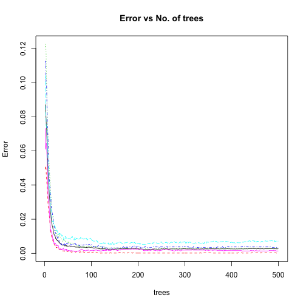

# Coursera Machine Learning Project 

Using devices such as Jawbone Up, Nike FuelBand, and Fitbit it is now possible to collect a large amount of data about personal activity relatively inexpensively. These type of devices are part of the quantified self movement ??? a group of enthusiasts who take measurements about themselves regularly to improve their health, to find patterns in their behavior, or because they are tech geeks. One thing that people regularly do is quantify how much of a particular activity they do, but they rarely quantify how well they do it. In this project, your goal will be to use data from accelerometers on the belt, forearm, arm, and dumbell of 6 participants. They were asked to perform barbell lifts correctly and incorrectly in 5 different ways. More information is available from the website here: http://groupware.les.inf.puc-rio.br/har (see the section on the Weight Lifting Exercise Dataset). 


## Modeling

Load the required library and setwd point it to the project folder.

```r
library(caret)
library(doMC)
library(randomForest)
registerDoMC(cores = 4)
setwd("/Users/bikash/repos/Coursera-Practical-Machine-Learning/project/")
```
First step is to process the data
1.  Read the data.
1.  Remove excel division error strings `#DIV/0!` and replace with `NA` values.
1.  Convert empty strings to `NA` values.


```r
print("Loading Data...")
```

```
## [1] "Loading Data..."
```

```r
train <- read.csv('pml-training.csv',header=TRUE,stringsAsFactors = F,na.strings=c('NA','','#DIV/0!'))
test <- read.csv('pml-testing.csv',header=TRUE,stringsAsFactors = F,na.strings=c('NA','','#DIV/0!'))
```

## Feature Selection

The next task is to explore the data and determine what is likely useful information.  An important goal of any model to generalize well with unseen data.  Given this,

1.  Any features that contained NA values should be removed.
1.  Some columns are dropped as any correlation that exists would likely be spurious and therefore cause the model to perform poorly.

```r
train<-train[,-seq(1:7)]
test<-test[,-seq(1:7)]
NA_d <- apply(train,2,function(x) {sum(is.na(x))}) 
train <- train[,which(NA_d == 0)]
NA_d <- apply(test,2,function(x) {sum(is.na(x))}) 
test <- test[,which(NA_d == 0)]
```
The first 7 column are unimportant. so, we removed it from the datasets. Then removing all NA values of data.

There are 53 variable for our prediction model.

```r
colnames(train)
```

```
##  [1] "roll_belt"            "pitch_belt"           "yaw_belt"            
##  [4] "total_accel_belt"     "gyros_belt_x"         "gyros_belt_y"        
##  [7] "gyros_belt_z"         "accel_belt_x"         "accel_belt_y"        
## [10] "accel_belt_z"         "magnet_belt_x"        "magnet_belt_y"       
## [13] "magnet_belt_z"        "roll_arm"             "pitch_arm"           
## [16] "yaw_arm"              "total_accel_arm"      "gyros_arm_x"         
## [19] "gyros_arm_y"          "gyros_arm_z"          "accel_arm_x"         
## [22] "accel_arm_y"          "accel_arm_z"          "magnet_arm_x"        
## [25] "magnet_arm_y"         "magnet_arm_z"         "roll_dumbbell"       
## [28] "pitch_dumbbell"       "yaw_dumbbell"         "total_accel_dumbbell"
## [31] "gyros_dumbbell_x"     "gyros_dumbbell_y"     "gyros_dumbbell_z"    
## [34] "accel_dumbbell_x"     "accel_dumbbell_y"     "accel_dumbbell_z"    
## [37] "magnet_dumbbell_x"    "magnet_dumbbell_y"    "magnet_dumbbell_z"   
## [40] "roll_forearm"         "pitch_forearm"        "yaw_forearm"         
## [43] "total_accel_forearm"  "gyros_forearm_x"      "gyros_forearm_y"     
## [46] "gyros_forearm_z"      "accel_forearm_x"      "accel_forearm_y"     
## [49] "accel_forearm_z"      "magnet_forearm_x"     "magnet_forearm_y"    
## [52] "magnet_forearm_z"     "classe"
```
## Cross Validation

Data Partition is achieved by splitting the training data into a test set and a training set. 80% training set and 20% testing set using the following:


```r
data_part <- createDataPartition(y=train$classe, p=0.80, list=FALSE )
training <- train[data_part,]
testing <- train[-data_part,]
```
The data was partioned by the `classe` variable to ensure the training set and test set contain examples of each class.


## PreProcess
Preprocess the prediction variables by centering and scaling.


```r
preProc<-preProcess(training[,-53])
train1<-predict(preProc,training[,-53])
test1<-predict(preProc,testing[,-53])
train1$classe <- training$classe
test1$classe <- testing$classe
```

## Removal of zero variance
Check for near zero variance. Removing all data which are near to zero covariance.


```r
nzVar <- nearZeroVar(train1, saveMetrics=TRUE)
if (any(nzVar$nzv)) nzVar else message("No variables with near zero variance")
```

```
## No variables with near zero variance
```

```r
train1 <- train1[,nzVar$nzv==FALSE]
nzVar <- nearZeroVar(test1, saveMetrics=TRUE)
if (any(nzVar$nzv)) nzVar else message("No variables with near zero variance")
```

```
## No variables with near zero variance
```

```r
test1 <- test1[,nzVar$nzv==FALSE]
```

## Prediction

The random forest model was initially used to prediction. We have created error estimation at first to check whether the random forest accuracy can be achived or not.

Running random forest on 80% training data and 20% testing data.

```r
RF<-randomForest(as.factor(training$classe) ~.,data = training[,-53],importance = TRUE)
pred_rf<-predict(RF,testing)
```


```r
CM<-confusionMatrix(pred_rf,testing$classe)
CM
```

```
## Confusion Matrix and Statistics
## 
##           Reference
## Prediction    A    B    C    D    E
##          A 1114    4    0    0    0
##          B    2  754    3    0    0
##          C    0    1  679    6    0
##          D    0    0    2  637    1
##          E    0    0    0    0  720
## 
## Overall Statistics
##                                           
##                Accuracy : 0.9952          
##                  95% CI : (0.9924, 0.9971)
##     No Information Rate : 0.2845          
##     P-Value [Acc > NIR] : < 2.2e-16       
##                                           
##                   Kappa : 0.9939          
##  Mcnemar's Test P-Value : NA              
## 
## Statistics by Class:
## 
##                      Class: A Class: B Class: C Class: D Class: E
## Sensitivity            0.9982   0.9934   0.9927   0.9907   0.9986
## Specificity            0.9986   0.9984   0.9978   0.9991   1.0000
## Pos Pred Value         0.9964   0.9934   0.9898   0.9953   1.0000
## Neg Pred Value         0.9993   0.9984   0.9985   0.9982   0.9997
## Prevalence             0.2845   0.1935   0.1744   0.1639   0.1838
## Detection Rate         0.2840   0.1922   0.1731   0.1624   0.1835
## Detection Prevalence   0.2850   0.1935   0.1749   0.1631   0.1835
## Balanced Accuracy      0.9984   0.9959   0.9953   0.9949   0.9993
```

```r
CM$overall  
```

```
##       Accuracy          Kappa  AccuracyLower  AccuracyUpper   AccuracyNull 
##      0.9951568      0.9938735      0.9924470      0.9970816      0.2844762 
## AccuracyPValue  McnemarPValue 
##      0.0000000            NaN
```


Now, run the same model for preprocessed data

```r
processRF<-randomForest(as.factor(train1$classe) ~.,data = train1[,predVar],importance = TRUE)
predictRF<-predict(processRF,test1)
```


```r
CM1 <- confusionMatrix(predictRF,test1$classe)
CM1
```

```
## Confusion Matrix and Statistics
## 
##           Reference
## Prediction    A    B    C    D    E
##          A 1114    4    0    0    0
##          B    2  754    1    0    0
##          C    0    1  682    5    0
##          D    0    0    1  638    1
##          E    0    0    0    0  720
## 
## Overall Statistics
##                                           
##                Accuracy : 0.9962          
##                  95% CI : (0.9937, 0.9979)
##     No Information Rate : 0.2845          
##     P-Value [Acc > NIR] : < 2.2e-16       
##                                           
##                   Kappa : 0.9952          
##  Mcnemar's Test P-Value : NA              
## 
## Statistics by Class:
## 
##                      Class: A Class: B Class: C Class: D Class: E
## Sensitivity            0.9982   0.9934   0.9971   0.9922   0.9986
## Specificity            0.9986   0.9991   0.9981   0.9994   1.0000
## Pos Pred Value         0.9964   0.9960   0.9913   0.9969   1.0000
## Neg Pred Value         0.9993   0.9984   0.9994   0.9985   0.9997
## Prevalence             0.2845   0.1935   0.1744   0.1639   0.1838
## Detection Rate         0.2840   0.1922   0.1738   0.1626   0.1835
## Detection Prevalence   0.2850   0.1930   0.1754   0.1631   0.1835
## Balanced Accuracy      0.9984   0.9962   0.9976   0.9958   0.9993
```

```r
CM1$overall 
```

```
##       Accuracy          Kappa  AccuracyLower  AccuracyUpper   AccuracyNull 
##      0.9961764      0.9951633      0.9937014      0.9978584      0.2844762 
## AccuracyPValue  McnemarPValue 
##      0.0000000            NaN
```


## Calculate accuracy percentage

```r
CM$overall[1]-CM1$overall[1] 
```

```
##     Accuracy 
## -0.001019628
```


### Final Prediction model
Now we run final prediction model on full datasets. In random forest the error does decrease with the number of trees. The following plot shows the training error vs number of trees.


```r
finalRF<-randomForest(as.factor(train$classe) ~.,data = train,importance = TRUE)
print(plot(finalRF,main="Error vs No. of trees"))
```

 

```
##                OOB            A           B           C           D
##   [1,] 0.087227846 0.0493468795 0.121079504 0.110175976 0.104362703
##   [2,] 0.083418194 0.0513051305 0.122512163 0.112649165 0.086242300
##   [3,] 0.078142002 0.0491569698 0.116846878 0.099726242 0.075197341
##   [4,] 0.072723975 0.0431180969 0.100848256 0.098059598 0.073788546
##   [5,] 0.064834231 0.0398809524 0.087275933 0.085092563 0.070539419
##   [6,] 0.056754553 0.0363740240 0.073980309 0.074039363 0.066600067
##   [7,] 0.048210683 0.0290611028 0.068899259 0.067073171 0.052255761
##   [8,] 0.043560111 0.0260789715 0.064777328 0.057254197 0.048944338
##   [9,] 0.038443604 0.0232473665 0.055719261 0.048708049 0.042775665
##  [10,] 0.033905292 0.0216919740 0.049040512 0.043735225 0.037106918
##  [11,] 0.030587632 0.0185585586 0.045406267 0.039106145 0.036363636
##  [12,] 0.025136948 0.0138439410 0.041567382 0.035504695 0.027812500
##  [13,] 0.023053724 0.0125718391 0.034327964 0.033099004 0.027465668
##  [14,] 0.020374815 0.0109495602 0.032198469 0.027509511 0.023676012
##  [15,] 0.017912733 0.0095067265 0.025586916 0.025168276 0.022097728
##  [16,] 0.016322367 0.0086067778 0.023715415 0.023990638 0.018979465
##  [17,] 0.015346181 0.0078867180 0.023182297 0.022228722 0.018668326
##  [18,] 0.014019168 0.0069905001 0.021338251 0.019883041 0.018662519
##  [19,] 0.012131716 0.0059139785 0.016596417 0.017251462 0.016485226
##  [20,] 0.011163217 0.0057347670 0.015279241 0.016081871 0.016796267
##  [21,] 0.010601967 0.0048387097 0.016069547 0.013450292 0.016169154
##  [22,] 0.010091229 0.0048387097 0.015011851 0.011984800 0.015858209
##  [23,] 0.009479639 0.0035842294 0.014485120 0.012277112 0.014925373
##  [24,] 0.008511289 0.0039426523 0.012904925 0.009938614 0.013370647
##  [25,] 0.008256039 0.0032258065 0.013431657 0.009643483 0.013681592
##  [26,] 0.007848334 0.0035842294 0.010534633 0.009935710 0.013681592
##  [27,] 0.007746407 0.0032258065 0.011061364 0.009643483 0.013059701
##  [28,] 0.007338701 0.0034050179 0.010534633 0.008474576 0.012126866
##  [29,] 0.007083885 0.0034050179 0.009744535 0.009351257 0.010883085
##  [30,] 0.006472327 0.0026881720 0.009217804 0.008182350 0.011504975
##  [31,] 0.006523290 0.0023297491 0.011588096 0.007013442 0.011504975
##  [32,] 0.006064621 0.0023297491 0.009744535 0.006428989 0.011815920
##  [33,] 0.005911732 0.0023297491 0.009744535 0.006136762 0.011504975
##  [34,] 0.005504026 0.0019713262 0.009217804 0.005260082 0.010572139
##  [35,] 0.005554989 0.0016129032 0.008954438 0.006136762 0.011194030
##  [36,] 0.005198247 0.0017921147 0.008691072 0.005260082 0.010572139
##  [37,] 0.004892468 0.0016129032 0.007900974 0.004675628 0.009950249
##  [38,] 0.004790541 0.0014336918 0.007110877 0.004967855 0.010572139
##  [39,] 0.004994394 0.0014336918 0.008164340 0.004967855 0.009950249
##  [40,] 0.004994394 0.0014336918 0.007900974 0.005260082 0.009639303
##  [41,] 0.004586688 0.0014336918 0.008427706 0.004967855 0.007773632
##  [42,] 0.004688615 0.0012544803 0.007900974 0.005844535 0.009017413
##  [43,] 0.004433799 0.0010752688 0.007110877 0.004967855 0.009328358
##  [44,] 0.004688615 0.0010752688 0.007374243 0.005260082 0.009950249
##  [45,] 0.004637652 0.0012544803 0.007110877 0.005844535 0.008706468
##  [46,] 0.004128020 0.0012544803 0.006320780 0.004675628 0.008706468
##  [47,] 0.004586688 0.0012544803 0.006320780 0.005844535 0.009328358
##  [48,] 0.004280909 0.0008960573 0.006584145 0.005844535 0.008706468
##  [49,] 0.004178983 0.0012544803 0.006057414 0.005552309 0.008706468
##  [50,] 0.004229946 0.0014336918 0.006057414 0.005260082 0.008706468
##  [51,] 0.004229946 0.0012544803 0.006584145 0.004967855 0.008706468
##  [52,] 0.004280909 0.0008960573 0.006847511 0.005844535 0.008706468
##  [53,] 0.004331872 0.0010752688 0.006584145 0.005844535 0.008706468
##  [54,] 0.004178983 0.0010752688 0.006320780 0.005844535 0.008395522
##  [55,] 0.003924167 0.0010752688 0.005267316 0.005260082 0.008706468
##  [56,] 0.003924167 0.0008960573 0.006320780 0.004675628 0.008084577
##  [57,] 0.004128020 0.0007168459 0.006057414 0.005260082 0.009639303
##  [58,] 0.004178983 0.0008960573 0.006057414 0.005260082 0.009328358
##  [59,] 0.004128020 0.0007168459 0.005794048 0.005260082 0.009950249
##  [60,] 0.004077056 0.0010752688 0.006057414 0.004967855 0.009017413
##  [61,] 0.004026093 0.0010752688 0.005530682 0.005552309 0.008706468
##  [62,] 0.004128020 0.0010752688 0.005794048 0.005844535 0.008706468
##  [63,] 0.003771277 0.0010752688 0.005003950 0.005844535 0.007773632
##  [64,] 0.003873204 0.0010752688 0.005003950 0.005552309 0.008706468
##  [65,] 0.003975130 0.0008960573 0.005003950 0.005844535 0.009328358
##  [66,] 0.003720314 0.0007168459 0.005267316 0.005552309 0.008084577
##  [67,] 0.003567424 0.0008960573 0.004740585 0.004675628 0.008395522
##  [68,] 0.003720314 0.0008960573 0.004477219 0.005260082 0.009017413
##  [69,] 0.003720314 0.0010752688 0.004740585 0.004967855 0.008706468
##  [70,] 0.003669351 0.0008960573 0.005003950 0.004967855 0.008395522
##  [71,] 0.003669351 0.0008960573 0.004477219 0.004967855 0.008706468
##  [72,] 0.003465498 0.0008960573 0.003687121 0.004675628 0.008706468
##  [73,] 0.003669351 0.0008960573 0.005003950 0.004967855 0.008084577
##  [74,] 0.003516461 0.0008960573 0.004213853 0.004383402 0.008395522
##  [75,] 0.003363572 0.0005376344 0.003950487 0.004383402 0.008706468
##  [76,] 0.003567424 0.0007168459 0.003687121 0.004967855 0.008706468
##  [77,] 0.003822240 0.0008960573 0.004213853 0.004675628 0.009328358
##  [78,] 0.003567424 0.0007168459 0.003423756 0.004967855 0.008706468
##  [79,] 0.003669351 0.0008960573 0.003423756 0.005260082 0.008395522
##  [80,] 0.003720314 0.0010752688 0.003423756 0.005260082 0.008395522
##  [81,] 0.003822240 0.0007168459 0.004213853 0.005260082 0.009017413
##  [82,] 0.003567424 0.0008960573 0.003950487 0.004675628 0.008395522
##  [83,] 0.003567424 0.0008960573 0.003950487 0.004967855 0.008395522
##  [84,] 0.003567424 0.0005376344 0.004477219 0.004967855 0.008395522
##  [85,] 0.003516461 0.0007168459 0.003950487 0.004967855 0.008395522
##  [86,] 0.003516461 0.0005376344 0.003687121 0.005260082 0.008706468
##  [87,] 0.003414535 0.0005376344 0.003950487 0.005260082 0.008084577
##  [88,] 0.003516461 0.0007168459 0.003687121 0.004967855 0.008706468
##  [89,] 0.003669351 0.0005376344 0.003950487 0.005260082 0.009017413
##  [90,] 0.003363572 0.0005376344 0.003423756 0.004967855 0.008395522
##  [91,] 0.003312608 0.0005376344 0.003687121 0.004967855 0.007773632
##  [92,] 0.003414535 0.0005376344 0.003950487 0.004675628 0.008084577
##  [93,] 0.003618388 0.0005376344 0.004213853 0.004967855 0.008706468
##  [94,] 0.003567424 0.0005376344 0.003687121 0.005260082 0.008706468
##  [95,] 0.003567424 0.0005376344 0.004213853 0.005260082 0.008706468
##  [96,] 0.003567424 0.0005376344 0.004213853 0.005260082 0.008706468
##  [97,] 0.003465498 0.0005376344 0.003950487 0.004675628 0.008706468
##  [98,] 0.003618388 0.0005376344 0.004213853 0.004967855 0.009017413
##  [99,] 0.003465498 0.0005376344 0.004213853 0.004675628 0.008395522
## [100,] 0.003465498 0.0005376344 0.003950487 0.005260082 0.008084577
## [101,] 0.003363572 0.0005376344 0.003950487 0.004967855 0.007773632
## [102,] 0.003363572 0.0005376344 0.004213853 0.004675628 0.007462687
## [103,] 0.003312608 0.0007168459 0.003950487 0.004675628 0.007462687
## [104,] 0.003057792 0.0007168459 0.003687121 0.003798948 0.007151741
## [105,] 0.003159719 0.0005376344 0.004213853 0.003798948 0.007151741
## [106,] 0.003057792 0.0003584229 0.003950487 0.004091175 0.007151741
## [107,] 0.003261645 0.0005376344 0.004213853 0.004383402 0.007151741
## [108,] 0.003108755 0.0005376344 0.003950487 0.003798948 0.007151741
## [109,] 0.003363572 0.0007168459 0.004477219 0.004383402 0.007151741
## [110,] 0.003261645 0.0007168459 0.003687121 0.004091175 0.007773632
## [111,] 0.003006829 0.0003584229 0.003423756 0.004091175 0.007151741
## [112,] 0.003108755 0.0003584229 0.003687121 0.004383402 0.007151741
## [113,] 0.003006829 0.0003584229 0.003687121 0.004091175 0.007151741
## [114,] 0.002853939 0.0001792115 0.003423756 0.004383402 0.006218905
## [115,] 0.002904903 0.0001792115 0.003687121 0.004675628 0.005907960
## [116,] 0.002955866 0.0003584229 0.003687121 0.004675628 0.006218905
## [117,] 0.002650087 0.0001792115 0.003160390 0.004383402 0.005907960
## [118,] 0.002701050 0.0003584229 0.003160390 0.004383402 0.005597015
## [119,] 0.002599123 0.0001792115 0.003687121 0.003798948 0.005597015
## [120,] 0.002802976 0.0001792115 0.004213853 0.004091175 0.005907960
## [121,] 0.002650087 0.0001792115 0.003687121 0.004091175 0.005597015
## [122,] 0.002701050 0.0001792115 0.003687121 0.004091175 0.005907960
## [123,] 0.002446234 0.0001792115 0.002897024 0.003506721 0.005597015
## [124,] 0.002802976 0.0001792115 0.003950487 0.003506721 0.006218905
## [125,] 0.002853939 0.0001792115 0.003423756 0.004383402 0.006529851
## [126,] 0.002650087 0.0001792115 0.003160390 0.003798948 0.006218905
## [127,] 0.002599123 0.0001792115 0.003160390 0.003798948 0.005597015
## [128,] 0.002650087 0.0001792115 0.003687121 0.003506721 0.005907960
## [129,] 0.002752013 0.0001792115 0.003687121 0.003798948 0.006218905
## [130,] 0.002446234 0.0001792115 0.002897024 0.003214494 0.005907960
## [131,] 0.002548160 0.0001792115 0.002633658 0.003214494 0.005907960
## [132,] 0.002446234 0.0001792115 0.002897024 0.003214494 0.005907960
## [133,] 0.002497197 0.0001792115 0.002897024 0.003214494 0.005597015
## [134,] 0.002599123 0.0003584229 0.003160390 0.002922268 0.005907960
## [135,] 0.002599123 0.0003584229 0.002897024 0.003214494 0.005907960
## [136,] 0.002395271 0.0001792115 0.002633658 0.002922268 0.006218905
## [137,] 0.002344307 0.0001792115 0.002897024 0.002922268 0.005286070
## [138,] 0.002650087 0.0003584229 0.003160390 0.003214494 0.006218905
## [139,] 0.002395271 0.0001792115 0.003160390 0.003214494 0.005286070
## [140,] 0.002344307 0.0003584229 0.002897024 0.003214494 0.004975124
## [141,] 0.002497197 0.0003584229 0.003160390 0.002922268 0.005907960
## [142,] 0.002497197 0.0001792115 0.002897024 0.003214494 0.005907960
## [143,] 0.002344307 0.0001792115 0.002633658 0.003214494 0.005286070
## [144,] 0.002344307 0.0001792115 0.002633658 0.002922268 0.005597015
## [145,] 0.002548160 0.0001792115 0.002633658 0.002922268 0.006529851
## [146,] 0.002497197 0.0001792115 0.002633658 0.003214494 0.005907960
## [147,] 0.002344307 0.0001792115 0.002897024 0.002922268 0.005286070
## [148,] 0.002344307 0.0001792115 0.002633658 0.003214494 0.005286070
## [149,] 0.002446234 0.0001792115 0.003160390 0.003214494 0.005286070
## [150,] 0.002497197 0.0001792115 0.002633658 0.003214494 0.005907960
## [151,] 0.002497197 0.0001792115 0.002370292 0.003214494 0.005907960
## [152,] 0.002599123 0.0001792115 0.003160390 0.003214494 0.006218905
## [153,] 0.002497197 0.0001792115 0.003423756 0.002922268 0.005597015
## [154,] 0.002548160 0.0001792115 0.002897024 0.003214494 0.006218905
## [155,] 0.002548160 0.0005376344 0.002897024 0.003214494 0.005907960
## [156,] 0.002599123 0.0003584229 0.003160390 0.003214494 0.006218905
## [157,] 0.002497197 0.0001792115 0.002897024 0.003214494 0.006218905
## [158,] 0.002701050 0.0003584229 0.003160390 0.003214494 0.006529851
## [159,] 0.002599123 0.0003584229 0.002897024 0.003214494 0.006218905
## [160,] 0.002752013 0.0005376344 0.003160390 0.003214494 0.006529851
## [161,] 0.002802976 0.0005376344 0.003160390 0.003214494 0.006529851
## [162,] 0.002752013 0.0005376344 0.003160390 0.003214494 0.006529851
## [163,] 0.002650087 0.0005376344 0.002897024 0.003214494 0.006218905
## [164,] 0.002701050 0.0003584229 0.003160390 0.003214494 0.006218905
## [165,] 0.002802976 0.0005376344 0.003160390 0.003506721 0.005907960
## [166,] 0.002650087 0.0001792115 0.003160390 0.003506721 0.005597015
## [167,] 0.002701050 0.0003584229 0.003160390 0.003506721 0.005907960
## [168,] 0.002650087 0.0003584229 0.002897024 0.003798948 0.005597015
## [169,] 0.002802976 0.0003584229 0.003160390 0.003798948 0.005907960
## [170,] 0.002650087 0.0003584229 0.002897024 0.003506721 0.005907960
## [171,] 0.002802976 0.0001792115 0.002897024 0.004091175 0.006218905
## [172,] 0.002650087 0.0001792115 0.003160390 0.003214494 0.006218905
## [173,] 0.002802976 0.0003584229 0.003160390 0.003798948 0.006218905
## [174,] 0.002904903 0.0003584229 0.003687121 0.003798948 0.006218905
## [175,] 0.002599123 0.0003584229 0.002370292 0.003506721 0.006218905
## [176,] 0.002904903 0.0003584229 0.003160390 0.003798948 0.006529851
## [177,] 0.002752013 0.0001792115 0.003160390 0.003506721 0.006529851
## [178,] 0.002752013 0.0003584229 0.002897024 0.003506721 0.006218905
## [179,] 0.002701050 0.0003584229 0.002633658 0.003506721 0.006218905
## [180,] 0.002752013 0.0003584229 0.002897024 0.003506721 0.006218905
## [181,] 0.002752013 0.0003584229 0.002633658 0.003798948 0.006218905
## [182,] 0.002650087 0.0001792115 0.002633658 0.003798948 0.005907960
## [183,] 0.002701050 0.0003584229 0.002633658 0.003798948 0.005907960
## [184,] 0.002650087 0.0001792115 0.002633658 0.003506721 0.006218905
## [185,] 0.002752013 0.0003584229 0.002633658 0.003798948 0.006218905
## [186,] 0.002752013 0.0003584229 0.002633658 0.003506721 0.006529851
## [187,] 0.002701050 0.0001792115 0.002633658 0.003798948 0.006218905
## [188,] 0.002752013 0.0001792115 0.002633658 0.003798948 0.006218905
## [189,] 0.002853939 0.0003584229 0.002897024 0.003798948 0.006529851
## [190,] 0.002802976 0.0003584229 0.002897024 0.004091175 0.005907960
## [191,] 0.002955866 0.0003584229 0.002897024 0.004675628 0.006218905
## [192,] 0.002904903 0.0001792115 0.002897024 0.004383402 0.006529851
## [193,] 0.002802976 0.0001792115 0.002897024 0.004091175 0.006218905
## [194,] 0.002802976 0.0003584229 0.002897024 0.004383402 0.005597015
## [195,] 0.002752013 0.0001792115 0.002633658 0.004091175 0.006218905
## [196,] 0.002701050 0.0001792115 0.002897024 0.003506721 0.006218905
## [197,] 0.002650087 0.0001792115 0.002897024 0.003798948 0.005597015
## [198,] 0.002752013 0.0001792115 0.002633658 0.004091175 0.005907960
## [199,] 0.002701050 0.0001792115 0.002633658 0.004091175 0.005907960
## [200,] 0.002650087 0.0001792115 0.002633658 0.004091175 0.005907960
## [201,] 0.002650087 0.0001792115 0.002633658 0.004383402 0.005597015
## [202,] 0.002548160 0.0001792115 0.002633658 0.003798948 0.005907960
## [203,] 0.002599123 0.0001792115 0.002633658 0.003798948 0.005907960
## [204,] 0.002497197 0.0001792115 0.002633658 0.003798948 0.005286070
## [205,] 0.002548160 0.0001792115 0.002897024 0.003214494 0.005597015
## [206,] 0.002599123 0.0001792115 0.002897024 0.003214494 0.005907960
## [207,] 0.002599123 0.0001792115 0.002633658 0.003798948 0.005597015
## [208,] 0.002497197 0.0001792115 0.002633658 0.003506721 0.005286070
## [209,] 0.002446234 0.0001792115 0.002633658 0.003214494 0.005286070
## [210,] 0.002446234 0.0001792115 0.002633658 0.003506721 0.005286070
## [211,] 0.002395271 0.0001792115 0.002633658 0.003798948 0.005286070
## [212,] 0.002395271 0.0001792115 0.002633658 0.003798948 0.005286070
## [213,] 0.002395271 0.0001792115 0.002633658 0.003506721 0.005286070
## [214,] 0.002344307 0.0001792115 0.002633658 0.003798948 0.005286070
## [215,] 0.002395271 0.0001792115 0.002633658 0.004091175 0.004975124
## [216,] 0.002395271 0.0001792115 0.002633658 0.003506721 0.005286070
## [217,] 0.002395271 0.0001792115 0.002633658 0.003506721 0.005286070
## [218,] 0.002344307 0.0001792115 0.002370292 0.003506721 0.005286070
## [219,] 0.002395271 0.0001792115 0.002633658 0.003506721 0.005597015
## [220,] 0.002395271 0.0001792115 0.002370292 0.003506721 0.005597015
## [221,] 0.002395271 0.0001792115 0.002633658 0.003506721 0.005597015
## [222,] 0.002446234 0.0001792115 0.002370292 0.003506721 0.005907960
## [223,] 0.002395271 0.0001792115 0.002370292 0.003506721 0.005597015
## [224,] 0.002497197 0.0001792115 0.002370292 0.003506721 0.005907960
## [225,] 0.002344307 0.0001792115 0.002370292 0.003506721 0.005597015
## [226,] 0.002344307 0.0001792115 0.002370292 0.003214494 0.005907960
## [227,] 0.002446234 0.0001792115 0.002370292 0.003506721 0.005907960
## [228,] 0.002395271 0.0001792115 0.002370292 0.003506721 0.005597015
## [229,] 0.002446234 0.0001792115 0.002370292 0.003506721 0.005907960
## [230,] 0.002395271 0.0001792115 0.002370292 0.003506721 0.005597015
## [231,] 0.002548160 0.0001792115 0.002370292 0.003506721 0.006218905
## [232,] 0.002446234 0.0001792115 0.002370292 0.003506721 0.005907960
## [233,] 0.002650087 0.0001792115 0.002370292 0.004091175 0.006218905
## [234,] 0.002548160 0.0001792115 0.002370292 0.003798948 0.006529851
## [235,] 0.002599123 0.0001792115 0.002370292 0.003798948 0.006529851
## [236,] 0.002548160 0.0001792115 0.002370292 0.003798948 0.006529851
## [237,] 0.002548160 0.0001792115 0.002370292 0.003798948 0.006529851
## [238,] 0.002497197 0.0001792115 0.002370292 0.003798948 0.006218905
## [239,] 0.002548160 0.0001792115 0.002370292 0.003798948 0.006218905
## [240,] 0.002497197 0.0001792115 0.002370292 0.003798948 0.005907960
## [241,] 0.002446234 0.0001792115 0.002370292 0.003798948 0.005907960
## [242,] 0.002395271 0.0001792115 0.002370292 0.003798948 0.005907960
## [243,] 0.002548160 0.0001792115 0.002633658 0.004091175 0.005597015
## [244,] 0.002548160 0.0001792115 0.002633658 0.003798948 0.005907960
## [245,] 0.002497197 0.0001792115 0.002633658 0.003506721 0.005907960
## [246,] 0.002497197 0.0001792115 0.002633658 0.004091175 0.005907960
## [247,] 0.002497197 0.0001792115 0.002633658 0.003798948 0.005907960
## [248,] 0.002548160 0.0001792115 0.002633658 0.003798948 0.005907960
## [249,] 0.002650087 0.0001792115 0.002633658 0.003798948 0.006840796
## [250,] 0.002701050 0.0001792115 0.002897024 0.003798948 0.006529851
## [251,] 0.002650087 0.0001792115 0.002897024 0.003798948 0.006218905
## [252,] 0.002599123 0.0001792115 0.002897024 0.003798948 0.005907960
## [253,] 0.002650087 0.0001792115 0.002897024 0.003798948 0.005907960
## [254,] 0.002650087 0.0001792115 0.002897024 0.003798948 0.005907960
## [255,] 0.002650087 0.0001792115 0.002897024 0.003798948 0.005907960
## [256,] 0.002497197 0.0001792115 0.002633658 0.003506721 0.005907960
## [257,] 0.002650087 0.0001792115 0.002633658 0.003798948 0.006218905
## [258,] 0.002701050 0.0001792115 0.002633658 0.003798948 0.006529851
## [259,] 0.002701050 0.0001792115 0.002897024 0.003798948 0.006218905
## [260,] 0.002701050 0.0001792115 0.002633658 0.003798948 0.006529851
## [261,] 0.002701050 0.0001792115 0.002633658 0.003798948 0.006529851
## [262,] 0.002701050 0.0001792115 0.002633658 0.004091175 0.006218905
## [263,] 0.002548160 0.0001792115 0.002633658 0.003506721 0.005907960
## [264,] 0.002548160 0.0001792115 0.002370292 0.003798948 0.006218905
## [265,] 0.002497197 0.0001792115 0.002370292 0.003798948 0.005907960
## [266,] 0.002599123 0.0001792115 0.002370292 0.003798948 0.006218905
## [267,] 0.002497197 0.0001792115 0.002370292 0.003798948 0.005907960
## [268,] 0.002548160 0.0001792115 0.002633658 0.003798948 0.005907960
## [269,] 0.002599123 0.0001792115 0.002633658 0.003798948 0.006218905
## [270,] 0.002650087 0.0001792115 0.002633658 0.003798948 0.006529851
## [271,] 0.002650087 0.0001792115 0.002633658 0.003798948 0.006529851
## [272,] 0.002599123 0.0001792115 0.002633658 0.003798948 0.006529851
## [273,] 0.002548160 0.0001792115 0.002633658 0.003798948 0.006218905
## [274,] 0.002650087 0.0001792115 0.002633658 0.003798948 0.006840796
## [275,] 0.002650087 0.0001792115 0.002633658 0.003798948 0.006840796
## [276,] 0.002599123 0.0001792115 0.002633658 0.003798948 0.006840796
## [277,] 0.002599123 0.0001792115 0.002633658 0.003798948 0.006840796
## [278,] 0.002599123 0.0001792115 0.002633658 0.003798948 0.006840796
## [279,] 0.002599123 0.0001792115 0.002633658 0.003798948 0.006529851
## [280,] 0.002548160 0.0001792115 0.002633658 0.003798948 0.006218905
## [281,] 0.002650087 0.0001792115 0.002633658 0.003798948 0.006529851
## [282,] 0.002701050 0.0001792115 0.002633658 0.004091175 0.006529851
## [283,] 0.002599123 0.0001792115 0.002633658 0.003798948 0.006218905
## [284,] 0.002497197 0.0001792115 0.002633658 0.003506721 0.006218905
## [285,] 0.002599123 0.0001792115 0.002633658 0.003798948 0.006218905
## [286,] 0.002548160 0.0001792115 0.002633658 0.003798948 0.005907960
## [287,] 0.002548160 0.0001792115 0.002633658 0.003798948 0.005907960
## [288,] 0.002650087 0.0001792115 0.002897024 0.003798948 0.006218905
## [289,] 0.002599123 0.0001792115 0.002633658 0.003798948 0.006529851
## [290,] 0.002548160 0.0001792115 0.002370292 0.003798948 0.006529851
## [291,] 0.002599123 0.0001792115 0.002633658 0.003798948 0.006840796
## [292,] 0.002497197 0.0001792115 0.002633658 0.003798948 0.005907960
## [293,] 0.002650087 0.0001792115 0.002897024 0.003798948 0.006218905
## [294,] 0.002701050 0.0001792115 0.002897024 0.003798948 0.006529851
## [295,] 0.002701050 0.0001792115 0.002897024 0.003798948 0.006529851
## [296,] 0.002752013 0.0001792115 0.002897024 0.004091175 0.006529851
## [297,] 0.002752013 0.0001792115 0.002897024 0.004091175 0.006529851
## [298,] 0.002802976 0.0001792115 0.002897024 0.004091175 0.006840796
## [299,] 0.002752013 0.0001792115 0.002897024 0.003798948 0.006840796
## [300,] 0.002802976 0.0001792115 0.002897024 0.004091175 0.006840796
## [301,] 0.002752013 0.0001792115 0.002897024 0.004091175 0.006529851
## [302,] 0.002599123 0.0001792115 0.002633658 0.004091175 0.005907960
## [303,] 0.002650087 0.0001792115 0.002633658 0.004091175 0.006218905
## [304,] 0.002650087 0.0001792115 0.002633658 0.004091175 0.006218905
## [305,] 0.002701050 0.0001792115 0.002633658 0.003798948 0.006840796
## [306,] 0.002599123 0.0001792115 0.002633658 0.003798948 0.006218905
## [307,] 0.002548160 0.0001792115 0.002633658 0.003798948 0.005907960
## [308,] 0.002650087 0.0001792115 0.002633658 0.003798948 0.006529851
## [309,] 0.002599123 0.0001792115 0.002633658 0.003506721 0.006529851
## [310,] 0.002701050 0.0001792115 0.002897024 0.003798948 0.006529851
## [311,] 0.002650087 0.0001792115 0.002633658 0.003798948 0.006529851
## [312,] 0.002650087 0.0001792115 0.002633658 0.003798948 0.006529851
## [313,] 0.002599123 0.0001792115 0.002897024 0.003506721 0.006218905
## [314,] 0.002599123 0.0001792115 0.002897024 0.003798948 0.005907960
## [315,] 0.002650087 0.0001792115 0.002897024 0.003798948 0.006218905
## [316,] 0.002650087 0.0001792115 0.002897024 0.003798948 0.005907960
## [317,] 0.002497197 0.0001792115 0.002897024 0.003214494 0.005907960
## [318,] 0.002599123 0.0001792115 0.002897024 0.003798948 0.005907960
## [319,] 0.002599123 0.0001792115 0.002897024 0.003798948 0.005907960
## [320,] 0.002548160 0.0001792115 0.002897024 0.003506721 0.005907960
## [321,] 0.002497197 0.0001792115 0.002897024 0.003214494 0.005907960
## [322,] 0.002548160 0.0001792115 0.002897024 0.003214494 0.006218905
## [323,] 0.002548160 0.0001792115 0.002897024 0.003214494 0.006218905
## [324,] 0.002548160 0.0001792115 0.002897024 0.003506721 0.005907960
## [325,] 0.002548160 0.0001792115 0.002897024 0.003214494 0.006218905
## [326,] 0.002599123 0.0001792115 0.003160390 0.003214494 0.006218905
## [327,] 0.002650087 0.0001792115 0.003160390 0.003506721 0.006218905
## [328,] 0.002650087 0.0001792115 0.003160390 0.003506721 0.006218905
## [329,] 0.002650087 0.0003584229 0.003160390 0.003214494 0.006218905
## [330,] 0.002599123 0.0001792115 0.002897024 0.003506721 0.006218905
## [331,] 0.002548160 0.0001792115 0.002897024 0.003214494 0.006218905
## [332,] 0.002548160 0.0001792115 0.003160390 0.003214494 0.005907960
## [333,] 0.002548160 0.0001792115 0.003160390 0.003214494 0.005907960
## [334,] 0.002599123 0.0003584229 0.003160390 0.003214494 0.005907960
## [335,] 0.002599123 0.0001792115 0.003160390 0.003506721 0.005907960
## [336,] 0.002650087 0.0003584229 0.003160390 0.003506721 0.005907960
## [337,] 0.002599123 0.0001792115 0.003160390 0.003506721 0.005907960
## [338,] 0.002701050 0.0001792115 0.003160390 0.003506721 0.006529851
## [339,] 0.002548160 0.0003584229 0.002897024 0.003506721 0.005597015
## [340,] 0.002548160 0.0003584229 0.002897024 0.003506721 0.005597015
## [341,] 0.002548160 0.0003584229 0.002897024 0.003506721 0.005597015
## [342,] 0.002701050 0.0003584229 0.002897024 0.003506721 0.006529851
## [343,] 0.002701050 0.0003584229 0.002897024 0.003506721 0.006529851
## [344,] 0.002650087 0.0003584229 0.002897024 0.003506721 0.006529851
## [345,] 0.002701050 0.0003584229 0.002897024 0.003506721 0.006529851
## [346,] 0.002599123 0.0003584229 0.002897024 0.003506721 0.005907960
## [347,] 0.002752013 0.0003584229 0.002897024 0.003506721 0.006840796
## [348,] 0.002650087 0.0003584229 0.002897024 0.003214494 0.006529851
## [349,] 0.002599123 0.0003584229 0.002897024 0.003214494 0.006529851
## [350,] 0.002599123 0.0003584229 0.002633658 0.003506721 0.006529851
## [351,] 0.002599123 0.0003584229 0.002633658 0.003506721 0.006529851
## [352,] 0.002650087 0.0003584229 0.002897024 0.003506721 0.006529851
## [353,] 0.002752013 0.0003584229 0.002897024 0.003506721 0.006840796
## [354,] 0.002802976 0.0003584229 0.003160390 0.003506721 0.006840796
## [355,] 0.002701050 0.0003584229 0.002897024 0.003506721 0.006529851
## [356,] 0.002752013 0.0003584229 0.002897024 0.003506721 0.006840796
## [357,] 0.002752013 0.0003584229 0.002897024 0.003506721 0.006840796
## [358,] 0.002752013 0.0003584229 0.002897024 0.003506721 0.006840796
## [359,] 0.002752013 0.0003584229 0.002897024 0.003506721 0.006840796
## [360,] 0.002650087 0.0001792115 0.002897024 0.003506721 0.006840796
## [361,] 0.002701050 0.0001792115 0.002633658 0.003506721 0.007151741
## [362,] 0.002752013 0.0001792115 0.002897024 0.003506721 0.007151741
## [363,] 0.002701050 0.0001792115 0.002633658 0.003506721 0.007151741
## [364,] 0.002650087 0.0001792115 0.002633658 0.003506721 0.006840796
## [365,] 0.002701050 0.0001792115 0.002633658 0.003506721 0.007151741
## [366,] 0.002701050 0.0001792115 0.002897024 0.003506721 0.006840796
## [367,] 0.002802976 0.0001792115 0.003160390 0.003506721 0.007151741
## [368,] 0.002701050 0.0001792115 0.002897024 0.003506721 0.006840796
## [369,] 0.002650087 0.0001792115 0.003160390 0.003506721 0.006529851
## [370,] 0.002701050 0.0001792115 0.003160390 0.003798948 0.006529851
## [371,] 0.002701050 0.0001792115 0.003160390 0.003798948 0.006529851
## [372,] 0.002650087 0.0001792115 0.002897024 0.003798948 0.006529851
## [373,] 0.002650087 0.0001792115 0.002897024 0.003506721 0.006840796
## [374,] 0.002599123 0.0001792115 0.002897024 0.003506721 0.006529851
## [375,] 0.002650087 0.0001792115 0.002897024 0.003506721 0.006840796
## [376,] 0.002650087 0.0001792115 0.002897024 0.003506721 0.006840796
## [377,] 0.002650087 0.0001792115 0.002897024 0.003506721 0.006840796
## [378,] 0.002701050 0.0001792115 0.002897024 0.003798948 0.006840796
## [379,] 0.002650087 0.0001792115 0.002897024 0.003506721 0.006840796
## [380,] 0.002701050 0.0001792115 0.002897024 0.003798948 0.006840796
## [381,] 0.002701050 0.0001792115 0.002897024 0.003798948 0.006840796
## [382,] 0.002650087 0.0001792115 0.002897024 0.003506721 0.007151741
## [383,] 0.002650087 0.0001792115 0.002897024 0.003506721 0.006840796
## [384,] 0.002650087 0.0001792115 0.002897024 0.003798948 0.006840796
## [385,] 0.002752013 0.0001792115 0.002897024 0.003798948 0.006840796
## [386,] 0.002599123 0.0001792115 0.002897024 0.003506721 0.006529851
## [387,] 0.002650087 0.0001792115 0.002897024 0.003506721 0.006840796
## [388,] 0.002752013 0.0001792115 0.002897024 0.003798948 0.007151741
## [389,] 0.002701050 0.0001792115 0.002897024 0.003798948 0.006840796
## [390,] 0.002701050 0.0001792115 0.002897024 0.003798948 0.006840796
## [391,] 0.002752013 0.0001792115 0.002897024 0.004091175 0.006840796
## [392,] 0.002752013 0.0001792115 0.002897024 0.004091175 0.006840796
## [393,] 0.002701050 0.0001792115 0.002897024 0.003798948 0.006840796
## [394,] 0.002701050 0.0001792115 0.002897024 0.003798948 0.006840796
## [395,] 0.002701050 0.0001792115 0.002897024 0.003798948 0.006840796
## [396,] 0.002701050 0.0001792115 0.002897024 0.003798948 0.006840796
## [397,] 0.002650087 0.0001792115 0.002897024 0.003798948 0.006529851
## [398,] 0.002599123 0.0001792115 0.002897024 0.003798948 0.006218905
## [399,] 0.002650087 0.0001792115 0.002897024 0.003798948 0.006529851
## [400,] 0.002650087 0.0001792115 0.002897024 0.003798948 0.006529851
## [401,] 0.002650087 0.0001792115 0.002897024 0.003798948 0.006529851
## [402,] 0.002599123 0.0001792115 0.002897024 0.003798948 0.006218905
## [403,] 0.002599123 0.0001792115 0.002897024 0.003798948 0.006218905
## [404,] 0.002599123 0.0001792115 0.002897024 0.003798948 0.006218905
## [405,] 0.002599123 0.0001792115 0.002897024 0.003798948 0.006218905
## [406,] 0.002599123 0.0001792115 0.002897024 0.003798948 0.006218905
## [407,] 0.002599123 0.0001792115 0.002897024 0.003798948 0.006218905
## [408,] 0.002548160 0.0001792115 0.002897024 0.003798948 0.005907960
## [409,] 0.002599123 0.0001792115 0.002897024 0.003798948 0.006218905
## [410,] 0.002599123 0.0001792115 0.002897024 0.003798948 0.006218905
## [411,] 0.002650087 0.0001792115 0.002897024 0.003798948 0.006529851
## [412,] 0.002599123 0.0001792115 0.002897024 0.003798948 0.006218905
## [413,] 0.002599123 0.0001792115 0.002897024 0.003798948 0.006218905
## [414,] 0.002650087 0.0003584229 0.002897024 0.003798948 0.006218905
## [415,] 0.002650087 0.0003584229 0.002897024 0.003798948 0.006218905
## [416,] 0.002650087 0.0003584229 0.002897024 0.003798948 0.006218905
## [417,] 0.002650087 0.0003584229 0.002897024 0.003798948 0.006218905
## [418,] 0.002650087 0.0003584229 0.002897024 0.003798948 0.006218905
## [419,] 0.002650087 0.0003584229 0.002897024 0.003798948 0.006218905
## [420,] 0.002701050 0.0003584229 0.002897024 0.003798948 0.006529851
## [421,] 0.002701050 0.0003584229 0.002897024 0.003798948 0.006529851
## [422,] 0.002650087 0.0003584229 0.002897024 0.003798948 0.006529851
## [423,] 0.002650087 0.0001792115 0.002897024 0.004091175 0.006529851
## [424,] 0.002650087 0.0001792115 0.002897024 0.004091175 0.006529851
## [425,] 0.002599123 0.0001792115 0.002897024 0.003798948 0.006529851
## [426,] 0.002599123 0.0001792115 0.002897024 0.003798948 0.006529851
## [427,] 0.002701050 0.0001792115 0.002897024 0.004091175 0.006840796
## [428,] 0.002701050 0.0001792115 0.002897024 0.004091175 0.006840796
## [429,] 0.002650087 0.0001792115 0.002897024 0.003798948 0.006840796
## [430,] 0.002701050 0.0001792115 0.002897024 0.004091175 0.006840796
## [431,] 0.002701050 0.0001792115 0.002897024 0.004091175 0.006840796
## [432,] 0.002752013 0.0001792115 0.002897024 0.004091175 0.007151741
## [433,] 0.002701050 0.0001792115 0.002897024 0.004091175 0.006840796
## [434,] 0.002650087 0.0001792115 0.002897024 0.003798948 0.006840796
## [435,] 0.002701050 0.0001792115 0.002897024 0.003798948 0.007151741
## [436,] 0.002752013 0.0003584229 0.002897024 0.003798948 0.007151741
## [437,] 0.002802976 0.0003584229 0.002897024 0.004091175 0.007151741
## [438,] 0.002802976 0.0003584229 0.002897024 0.003798948 0.007462687
## [439,] 0.002752013 0.0001792115 0.003160390 0.003798948 0.007151741
## [440,] 0.002802976 0.0001792115 0.003160390 0.003798948 0.007151741
## [441,] 0.002802976 0.0001792115 0.003160390 0.003798948 0.007151741
## [442,] 0.002752013 0.0001792115 0.003160390 0.003798948 0.006840796
## [443,] 0.002853939 0.0003584229 0.003160390 0.003798948 0.007151741
## [444,] 0.002802976 0.0003584229 0.003160390 0.003798948 0.007151741
## [445,] 0.002904903 0.0003584229 0.003160390 0.003798948 0.007462687
## [446,] 0.002904903 0.0003584229 0.003160390 0.003798948 0.007462687
## [447,] 0.002853939 0.0003584229 0.003160390 0.003798948 0.007151741
## [448,] 0.002853939 0.0003584229 0.003160390 0.003798948 0.007462687
## [449,] 0.002752013 0.0003584229 0.003160390 0.003798948 0.006840796
## [450,] 0.002802976 0.0003584229 0.003160390 0.003798948 0.007151741
## [451,] 0.002853939 0.0003584229 0.003160390 0.003798948 0.007151741
## [452,] 0.002853939 0.0003584229 0.002897024 0.003798948 0.007462687
## [453,] 0.002650087 0.0003584229 0.002897024 0.003798948 0.006529851
## [454,] 0.002802976 0.0003584229 0.003160390 0.003798948 0.006840796
## [455,] 0.002802976 0.0003584229 0.003160390 0.003798948 0.007151741
## [456,] 0.002752013 0.0003584229 0.003160390 0.003798948 0.006840796
## [457,] 0.002802976 0.0003584229 0.003160390 0.003798948 0.007151741
## [458,] 0.002752013 0.0003584229 0.003160390 0.003798948 0.006840796
## [459,] 0.002802976 0.0003584229 0.003160390 0.003798948 0.006840796
## [460,] 0.002701050 0.0001792115 0.003160390 0.003798948 0.006840796
## [461,] 0.002701050 0.0003584229 0.003160390 0.003798948 0.006529851
## [462,] 0.002701050 0.0003584229 0.003160390 0.003798948 0.006529851
## [463,] 0.002701050 0.0001792115 0.003160390 0.003798948 0.006840796
## [464,] 0.002752013 0.0003584229 0.003160390 0.003798948 0.006840796
## [465,] 0.002802976 0.0003584229 0.003160390 0.003798948 0.007151741
## [466,] 0.002752013 0.0003584229 0.003160390 0.003798948 0.006840796
## [467,] 0.002701050 0.0003584229 0.002897024 0.003798948 0.006840796
## [468,] 0.002599123 0.0001792115 0.002897024 0.003798948 0.006529851
## [469,] 0.002701050 0.0003584229 0.002897024 0.003798948 0.006840796
## [470,] 0.002701050 0.0003584229 0.002897024 0.003798948 0.006840796
## [471,] 0.002701050 0.0003584229 0.002897024 0.003798948 0.006840796
## [472,] 0.002853939 0.0003584229 0.003160390 0.003798948 0.007462687
## [473,] 0.002802976 0.0003584229 0.003160390 0.003798948 0.007151741
## [474,] 0.002752013 0.0003584229 0.002897024 0.003798948 0.007151741
## [475,] 0.002752013 0.0003584229 0.002897024 0.003798948 0.007151741
## [476,] 0.002752013 0.0003584229 0.002897024 0.003798948 0.007151741
## [477,] 0.002752013 0.0003584229 0.002897024 0.003798948 0.007151741
## [478,] 0.002752013 0.0003584229 0.002897024 0.003798948 0.007151741
## [479,] 0.002752013 0.0003584229 0.002897024 0.003798948 0.007151741
## [480,] 0.002853939 0.0003584229 0.002897024 0.003798948 0.007462687
## [481,] 0.002802976 0.0003584229 0.002897024 0.003798948 0.007151741
## [482,] 0.002853939 0.0003584229 0.002897024 0.003798948 0.007462687
## [483,] 0.002802976 0.0003584229 0.002897024 0.003798948 0.007151741
## [484,] 0.002802976 0.0003584229 0.002897024 0.003506721 0.007462687
## [485,] 0.002802976 0.0003584229 0.002897024 0.003506721 0.007462687
## [486,] 0.002802976 0.0003584229 0.002897024 0.003506721 0.007462687
## [487,] 0.002802976 0.0003584229 0.002897024 0.003506721 0.007462687
## [488,] 0.002752013 0.0003584229 0.002897024 0.003506721 0.007151741
## [489,] 0.002802976 0.0003584229 0.002897024 0.003506721 0.007462687
## [490,] 0.002701050 0.0003584229 0.002897024 0.003506721 0.006840796
## [491,] 0.002701050 0.0003584229 0.003160390 0.003506721 0.006840796
## [492,] 0.002802976 0.0003584229 0.002897024 0.003506721 0.007462687
## [493,] 0.002701050 0.0003584229 0.002897024 0.003506721 0.006840796
## [494,] 0.002752013 0.0003584229 0.002897024 0.003506721 0.007151741
## [495,] 0.002701050 0.0003584229 0.002897024 0.003506721 0.007151741
## [496,] 0.002701050 0.0001792115 0.003160390 0.003506721 0.007151741
## [497,] 0.002650087 0.0001792115 0.002897024 0.003506721 0.007151741
## [498,] 0.002650087 0.0003584229 0.002897024 0.003506721 0.006840796
## [499,] 0.002752013 0.0003584229 0.003160390 0.003506721 0.007151741
## [500,] 0.002802976 0.0003584229 0.003160390 0.003798948 0.007151741
##                  E
##   [1,] 0.073245952
##   [2,] 0.061015370
##   [3,] 0.064237415
##   [4,] 0.064123644
##   [5,] 0.055710306
##   [6,] 0.045199409
##   [7,] 0.034662045
##   [8,] 0.030475648
##   [9,] 0.030234530
##  [10,] 0.024726047
##  [11,] 0.020402459
##  [12,] 0.013106525
##  [13,] 0.013927577
##  [14,] 0.012791991
##  [15,] 0.012225618
##  [16,] 0.010830325
##  [17,] 0.009151414
##  [18,] 0.007487521
##  [19,] 0.008317161
##  [20,] 0.005544774
##  [21,] 0.006099251
##  [22,] 0.006099251
##  [23,] 0.005822013
##  [24,] 0.005267535
##  [25,] 0.004435819
##  [26,] 0.004435819
##  [27,] 0.004713058
##  [28,] 0.004713058
##  [29,] 0.004435819
##  [30,] 0.003326864
##  [31,] 0.002772387
##  [32,] 0.002495148
##  [33,] 0.002217910
##  [34,] 0.002772387
##  [35,] 0.002495148
##  [36,] 0.001940671
##  [37,] 0.002495148
##  [38,] 0.002217910
##  [39,] 0.002772387
##  [40,] 0.003049626
##  [41,] 0.002217910
##  [42,] 0.001663432
##  [43,] 0.001940671
##  [44,] 0.002217910
##  [45,] 0.002495148
##  [46,] 0.001663432
##  [47,] 0.002495148
##  [48,] 0.001663432
##  [49,] 0.001386194
##  [50,] 0.001663432
##  [51,] 0.001663432
##  [52,] 0.001386194
##  [53,] 0.001663432
##  [54,] 0.001386194
##  [55,] 0.001386194
##  [56,] 0.001663432
##  [57,] 0.001386194
##  [58,] 0.001663432
##  [59,] 0.001386194
##  [60,] 0.001386194
##  [61,] 0.001386194
##  [62,] 0.001386194
##  [63,] 0.001108955
##  [64,] 0.001108955
##  [65,] 0.001108955
##  [66,] 0.001108955
##  [67,] 0.001108955
##  [68,] 0.001108955
##  [69,] 0.001108955
##  [70,] 0.001108955
##  [71,] 0.001386194
##  [72,] 0.001386194
##  [73,] 0.001386194
##  [74,] 0.001663432
##  [75,] 0.001386194
##  [76,] 0.001940671
##  [77,] 0.002217910
##  [78,] 0.002217910
##  [79,] 0.002495148
##  [80,] 0.002495148
##  [81,] 0.002217910
##  [82,] 0.001940671
##  [83,] 0.001663432
##  [84,] 0.001663432
##  [85,] 0.001663432
##  [86,] 0.001663432
##  [87,] 0.001386194
##  [88,] 0.001663432
##  [89,] 0.001940671
##  [90,] 0.001663432
##  [91,] 0.001663432
##  [92,] 0.001940671
##  [93,] 0.001940671
##  [94,] 0.001940671
##  [95,] 0.001386194
##  [96,] 0.001386194
##  [97,] 0.001663432
##  [98,] 0.001663432
##  [99,] 0.001663432
## [100,] 0.001663432
## [101,] 0.001663432
## [102,] 0.001940671
## [103,] 0.001663432
## [104,] 0.001663432
## [105,] 0.001940671
## [106,] 0.001663432
## [107,] 0.001940671
## [108,] 0.001940671
## [109,] 0.001940671
## [110,] 0.001940671
## [111,] 0.001940671
## [112,] 0.001940671
## [113,] 0.001663432
## [114,] 0.001940671
## [115,] 0.001940671
## [116,] 0.001663432
## [117,] 0.001386194
## [118,] 0.001663432
## [119,] 0.001386194
## [120,] 0.001386194
## [121,] 0.001386194
## [122,] 0.001386194
## [123,] 0.001663432
## [124,] 0.001940671
## [125,] 0.001663432
## [126,] 0.001663432
## [127,] 0.001940671
## [128,] 0.001663432
## [129,] 0.001663432
## [130,] 0.001663432
## [131,] 0.002495148
## [132,] 0.001663432
## [133,] 0.002217910
## [134,] 0.002217910
## [135,] 0.002217910
## [136,] 0.001663432
## [137,] 0.001940671
## [138,] 0.001940671
## [139,] 0.001663432
## [140,] 0.001663432
## [141,] 0.001663432
## [142,] 0.001940671
## [143,] 0.001940671
## [144,] 0.001940671
## [145,] 0.002217910
## [146,] 0.002217910
## [147,] 0.001940671
## [148,] 0.001940671
## [149,] 0.001940671
## [150,] 0.002217910
## [151,] 0.002495148
## [152,] 0.001940671
## [153,] 0.001940671
## [154,] 0.001940671
## [155,] 0.001663432
## [156,] 0.001663432
## [157,] 0.001663432
## [158,] 0.001940671
## [159,] 0.001940671
## [160,] 0.001940671
## [161,] 0.002217910
## [162,] 0.001940671
## [163,] 0.001940671
## [164,] 0.002217910
## [165,] 0.002495148
## [166,] 0.002495148
## [167,] 0.002217910
## [168,] 0.002217910
## [169,] 0.002495148
## [170,] 0.002217910
## [171,] 0.002495148
## [172,] 0.002217910
## [173,] 0.002217910
## [174,] 0.002217910
## [175,] 0.002217910
## [176,] 0.002495148
## [177,] 0.002217910
## [178,] 0.002495148
## [179,] 0.002495148
## [180,] 0.002495148
## [181,] 0.002495148
## [182,] 0.002495148
## [183,] 0.002495148
## [184,] 0.002495148
## [185,] 0.002495148
## [186,] 0.002495148
## [187,] 0.002495148
## [188,] 0.002772387
## [189,] 0.002495148
## [190,] 0.002495148
## [191,] 0.002495148
## [192,] 0.002495148
## [193,] 0.002495148
## [194,] 0.002495148
## [195,] 0.002495148
## [196,] 0.002495148
## [197,] 0.002495148
## [198,] 0.002772387
## [199,] 0.002495148
## [200,] 0.002217910
## [201,] 0.002217910
## [202,] 0.001940671
## [203,] 0.002217910
## [204,] 0.002217910
## [205,] 0.002495148
## [206,] 0.002495148
## [207,] 0.002495148
## [208,] 0.002495148
## [209,] 0.002495148
## [210,] 0.002217910
## [211,] 0.001663432
## [212,] 0.001663432
## [213,] 0.001940671
## [214,] 0.001386194
## [215,] 0.001663432
## [216,] 0.001940671
## [217,] 0.001940671
## [218,] 0.001940671
## [219,] 0.001663432
## [220,] 0.001940671
## [221,] 0.001663432
## [222,] 0.001940671
## [223,] 0.001940671
## [224,] 0.002217910
## [225,] 0.001663432
## [226,] 0.001663432
## [227,] 0.001940671
## [228,] 0.001940671
## [229,] 0.001940671
## [230,] 0.001940671
## [231,] 0.002217910
## [232,] 0.001940671
## [233,] 0.002217910
## [234,] 0.001663432
## [235,] 0.001940671
## [236,] 0.001663432
## [237,] 0.001663432
## [238,] 0.001663432
## [239,] 0.001940671
## [240,] 0.001940671
## [241,] 0.001663432
## [242,] 0.001386194
## [243,] 0.001940671
## [244,] 0.001940671
## [245,] 0.001940671
## [246,] 0.001386194
## [247,] 0.001663432
## [248,] 0.001940671
## [249,] 0.001663432
## [250,] 0.001940671
## [251,] 0.001940671
## [252,] 0.001940671
## [253,] 0.002217910
## [254,] 0.002217910
## [255,] 0.002217910
## [256,] 0.001940671
## [257,] 0.002217910
## [258,] 0.002217910
## [259,] 0.002217910
## [260,] 0.002217910
## [261,] 0.002217910
## [262,] 0.002217910
## [263,] 0.002217910
## [264,] 0.001940671
## [265,] 0.001940671
## [266,] 0.002217910
## [267,] 0.001940671
## [268,] 0.001940671
## [269,] 0.001940671
## [270,] 0.001940671
## [271,] 0.001940671
## [272,] 0.001663432
## [273,] 0.001663432
## [274,] 0.001663432
## [275,] 0.001663432
## [276,] 0.001386194
## [277,] 0.001386194
## [278,] 0.001386194
## [279,] 0.001663432
## [280,] 0.001663432
## [281,] 0.001940671
## [282,] 0.001940671
## [283,] 0.001940671
## [284,] 0.001663432
## [285,] 0.001940671
## [286,] 0.001940671
## [287,] 0.001940671
## [288,] 0.001940671
## [289,] 0.001663432
## [290,] 0.001663432
## [291,] 0.001386194
## [292,] 0.001663432
## [293,] 0.001940671
## [294,] 0.001940671
## [295,] 0.001940671
## [296,] 0.001940671
## [297,] 0.001940671
## [298,] 0.001940671
## [299,] 0.001940671
## [300,] 0.001940671
## [301,] 0.001940671
## [302,] 0.001940671
## [303,] 0.001940671
## [304,] 0.001940671
## [305,] 0.001940671
## [306,] 0.001940671
## [307,] 0.001940671
## [308,] 0.001940671
## [309,] 0.001940671
## [310,] 0.001940671
## [311,] 0.001940671
## [312,] 0.001940671
## [313,] 0.001940671
## [314,] 0.001940671
## [315,] 0.001940671
## [316,] 0.002217910
## [317,] 0.001940671
## [318,] 0.001940671
## [319,] 0.001940671
## [320,] 0.001940671
## [321,] 0.001940671
## [322,] 0.001940671
## [323,] 0.001940671
## [324,] 0.001940671
## [325,] 0.001940671
## [326,] 0.001940671
## [327,] 0.001940671
## [328,] 0.001940671
## [329,] 0.001940671
## [330,] 0.001940671
## [331,] 0.001940671
## [332,] 0.001940671
## [333,] 0.001940671
## [334,] 0.001940671
## [335,] 0.001940671
## [336,] 0.001940671
## [337,] 0.001940671
## [338,] 0.001940671
## [339,] 0.001940671
## [340,] 0.001940671
## [341,] 0.001940671
## [342,] 0.001940671
## [343,] 0.001940671
## [344,] 0.001663432
## [345,] 0.001940671
## [346,] 0.001940671
## [347,] 0.001940671
## [348,] 0.001940671
## [349,] 0.001663432
## [350,] 0.001663432
## [351,] 0.001663432
## [352,] 0.001663432
## [353,] 0.001940671
## [354,] 0.001940671
## [355,] 0.001940671
## [356,] 0.001940671
## [357,] 0.001940671
## [358,] 0.001940671
## [359,] 0.001940671
## [360,] 0.001663432
## [361,] 0.001940671
## [362,] 0.001940671
## [363,] 0.001940671
## [364,] 0.001940671
## [365,] 0.001940671
## [366,] 0.001940671
## [367,] 0.001940671
## [368,] 0.001940671
## [369,] 0.001663432
## [370,] 0.001663432
## [371,] 0.001663432
## [372,] 0.001663432
## [373,] 0.001663432
## [374,] 0.001663432
## [375,] 0.001663432
## [376,] 0.001663432
## [377,] 0.001663432
## [378,] 0.001663432
## [379,] 0.001663432
## [380,] 0.001663432
## [381,] 0.001663432
## [382,] 0.001386194
## [383,] 0.001663432
## [384,] 0.001386194
## [385,] 0.001940671
## [386,] 0.001663432
## [387,] 0.001663432
## [388,] 0.001663432
## [389,] 0.001663432
## [390,] 0.001663432
## [391,] 0.001663432
## [392,] 0.001663432
## [393,] 0.001663432
## [394,] 0.001663432
## [395,] 0.001663432
## [396,] 0.001663432
## [397,] 0.001663432
## [398,] 0.001663432
## [399,] 0.001663432
## [400,] 0.001663432
## [401,] 0.001663432
## [402,] 0.001663432
## [403,] 0.001663432
## [404,] 0.001663432
## [405,] 0.001663432
## [406,] 0.001663432
## [407,] 0.001663432
## [408,] 0.001663432
## [409,] 0.001663432
## [410,] 0.001663432
## [411,] 0.001663432
## [412,] 0.001663432
## [413,] 0.001663432
## [414,] 0.001663432
## [415,] 0.001663432
## [416,] 0.001663432
## [417,] 0.001663432
## [418,] 0.001663432
## [419,] 0.001663432
## [420,] 0.001663432
## [421,] 0.001663432
## [422,] 0.001386194
## [423,] 0.001386194
## [424,] 0.001386194
## [425,] 0.001386194
## [426,] 0.001386194
## [427,] 0.001386194
## [428,] 0.001386194
## [429,] 0.001386194
## [430,] 0.001386194
## [431,] 0.001386194
## [432,] 0.001386194
## [433,] 0.001386194
## [434,] 0.001386194
## [435,] 0.001386194
## [436,] 0.001386194
## [437,] 0.001386194
## [438,] 0.001386194
## [439,] 0.001386194
## [440,] 0.001663432
## [441,] 0.001663432
## [442,] 0.001663432
## [443,] 0.001663432
## [444,] 0.001386194
## [445,] 0.001663432
## [446,] 0.001663432
## [447,] 0.001663432
## [448,] 0.001386194
## [449,] 0.001386194
## [450,] 0.001386194
## [451,] 0.001663432
## [452,] 0.001663432
## [453,] 0.001386194
## [454,] 0.001663432
## [455,] 0.001386194
## [456,] 0.001386194
## [457,] 0.001386194
## [458,] 0.001386194
## [459,] 0.001663432
## [460,] 0.001386194
## [461,] 0.001386194
## [462,] 0.001386194
## [463,] 0.001386194
## [464,] 0.001386194
## [465,] 0.001386194
## [466,] 0.001386194
## [467,] 0.001386194
## [468,] 0.001386194
## [469,] 0.001386194
## [470,] 0.001386194
## [471,] 0.001386194
## [472,] 0.001386194
## [473,] 0.001386194
## [474,] 0.001386194
## [475,] 0.001386194
## [476,] 0.001386194
## [477,] 0.001386194
## [478,] 0.001386194
## [479,] 0.001386194
## [480,] 0.001663432
## [481,] 0.001663432
## [482,] 0.001663432
## [483,] 0.001663432
## [484,] 0.001663432
## [485,] 0.001663432
## [486,] 0.001663432
## [487,] 0.001663432
## [488,] 0.001663432
## [489,] 0.001663432
## [490,] 0.001663432
## [491,] 0.001386194
## [492,] 0.001663432
## [493,] 0.001663432
## [494,] 0.001663432
## [495,] 0.001386194
## [496,] 0.001386194
## [497,] 0.001386194
## [498,] 0.001386194
## [499,] 0.001386194
## [500,] 0.001386194
```

## Final prediction on test datasets

```r
finalRF.pred<-predict(finalRF,test)
finalRF.pred
```

```
##  1  2  3  4  5  6  7  8  9 10 11 12 13 14 15 16 17 18 19 20 
##  B  A  B  A  A  E  D  B  A  A  B  C  B  A  E  E  A  B  B  B 
## Levels: A B C D E
```
### Variable Importance

```r
print(plot(varImp(finalRF, scale = FALSE)))
```

 

```
## NULL
```

The figure shows the importance variable used for classe (A,B,C,D,E).


## Conclusion

The random forest algorithm appears to fit very well for predicting activities from accelerometers measurements.


## Submission of programming assignment for 20 different test cases is explained below:
Code is provided by Coursera. Using this code and prediction result from the above results.

```r
pml_write_files = function(x){
  n = length(x)
  path <- "assignment/"
  for(i in 1:n){
    filename = paste0("problem_id_",i,".txt")
    write.table(x[i],file=file.path(path, filename),quote=FALSE,row.names=FALSE,col.names=FALSE)
  }
}
```

Converting prediction result to character in 20 different test cases and using coursera assignment code we created 20 different file for problem.

```r
pml_write_files( as.character(finalRF.pred))
```
